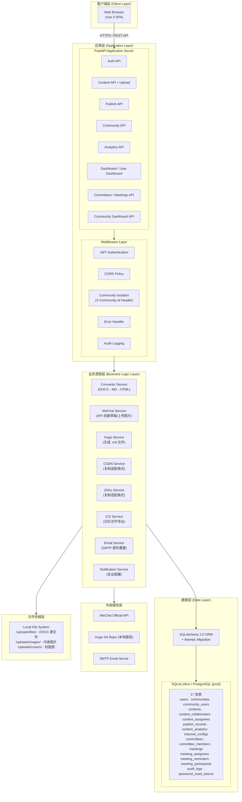
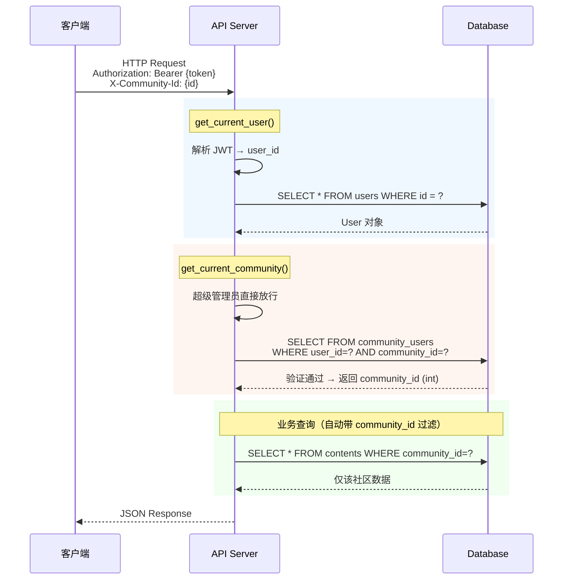

# openGecko - 系统架构设计文档

**项目名称**: openGecko - 多社区运营管理平台
**文档版本**: v3.0
**更新日期**: 2026-02-21
**架构风格**: 前后端分离 + 多租户 SaaS 架构
**品牌定位**: Manage All, Publish Everywhere

---

## 1. 架构概览

### 1.1 总体架构图



### 1.2 技术栈选型

| 层级 | 技术选型 | 版本 | 说明 |
|------|---------|------|------|
| **前端框架** | Vue 3 + Vite | 3.5 / 6.x | `<script setup lang="ts">`，Composition API |
| **状态管理** | Pinia | 2.x | 按领域拆分 Store（auth / community / user）|
| **UI 组件库** | Element Plus | 2.x | 企业级组件，配合 LFX Insights 浅色主题 |
| **日历组件** | FullCalendar | 6.x | 内容排期 + 会议日历，支持拖拽 |
| **Markdown 编辑器** | md-editor-v3 | 5.x | Vue 3 原生支持，实时预览 |
| **HTTP 客户端** | Axios | 1.x | 拦截器自动附加 JWT Token 和 X-Community-Id |
| **构建工具** | Vite | 6.x | 快速冷启动，HMR 高效 |
| **后端框架** | FastAPI | 0.115+ | 异步，自动生成 OpenAPI 文档 |
| **ORM** | SQLAlchemy | 2.0 | 声明式模型，Alembic 迁移管理 |
| **数据校验** | Pydantic v2 | 2.x | 所有请求/响应 Schema 强类型校验 |
| **数据库** | SQLite / PostgreSQL | — | 开发用 SQLite，生产推荐 PostgreSQL |
| **身份认证** | JWT (python-jose) + bcrypt | — | `passlib` 密码哈希 |
| **加密** | Fernet | — | 渠道凭证加密，密钥派生自 JWT_SECRET_KEY |
| **DOCX 处理** | python-mammoth | 1.6+ | DOCX → HTML 转换 |
| **容器化** | Docker Compose | v2 | 开发/生产双 compose 文件 |

---

## 2. 多租户架构设计

### 2.1 多租户模式

采用**共享数据库、共享 Schema、community_id 行级隔离**模式：

- 所有社区范围的数据表均含 `community_id` 列
- 前端每个请求携带 `X-Community-Id` Header
- 后端通过 `get_current_community` 依赖注入强制验证访问权限，返回 `int` 类型的 `community_id`
- API 层不信任前端传入的 community 参数，所有 community 过滤均在依赖层完成

**涉及社区隔离的表**：`contents`、`channel_configs`、`audit_logs`、`publish_records`、`committees`、`meetings`

### 2.2 租户识别流程



### 2.3 RBAC 权限体系

系统实现三级权限模型：

| 角色 | 范围 | 说明 |
|------|------|------|
| **superuser** | 全局 | `users.is_superuser=True`，可跨社区访问所有数据 |
| **admin** | 社区级 | `community_users.role='admin'`，管理本社区成员/内容/渠道 |
| **user** | 社区级 | `community_users.role='user'`，仅可操作自己负责的内容 |

**内容权限细则**：
- `created_by_user_id`（不可变）：记录创建者
- `owner_id`（可转让）：控制主编辑权
- `content_collaborators`（多对多）：协作编辑权
- `content_assignees`（多对多）：内容责任人

编辑权限：owner、collaborator、社区 admin、superuser 均可编辑。

---

## 3. 后端结构

### 3.1 目录结构

```
backend/app/
├── api/                         # FastAPI 路由（薄层，不含业务逻辑）
│   ├── auth.py                  # 登录、当前用户、密码重置
│   ├── communities.py           # 社区 CRUD + 成员管理
│   ├── contents.py              # 内容 CRUD + 状态流转 + 协作者/责任人
│   ├── upload.py                # 文件上传（注册在 /api/contents 前缀下）
│   ├── publish.py               # 多渠道发布 + 发布记录
│   ├── channels.py              # 渠道配置管理
│   ├── committees.py            # 委员会 CRUD + 成员管理
│   ├── meetings.py              # 会议 CRUD + ICS 导出 + 与会人
│   ├── analytics.py             # 数据分析统计
│   ├── dashboard.py             # 个人工作台（注册在 /api/users/me 前缀下）
│   └── community_dashboard.py  # 社区概览仪表板
│
├── models/                      # SQLAlchemy ORM 模型（17 张表）
│   ├── user.py                  # User + community_users 关联表
│   ├── community.py             # Community
│   ├── content.py               # Content + content_collaborators + content_assignees
│   ├── publish_record.py        # PublishRecord + ContentAnalytics
│   ├── channel.py               # ChannelConfig
│   ├── committee.py             # Committee + CommitteeMember
│   ├── meeting.py               # Meeting + MeetingReminder + MeetingParticipant + meeting_assignees
│   ├── audit.py                 # AuditLog
│   └── password_reset.py        # PasswordResetToken
│
├── schemas/                     # Pydantic 请求/响应 Schema
├── services/                    # 业务逻辑 + 外部集成
│   ├── converter.py             # DOCX/MD → HTML 转换
│   ├── wechat.py                # 微信公众号 API
│   ├── hugo.py                  # Hugo 博客文件生成
│   ├── csdn.py                  # CSDN 格式适配
│   ├── zhihu.py                 # 知乎格式适配
│   ├── ics.py                   # ICS 日历文件生成
│   ├── email.py                 # SMTP 邮件发送
│   └── notification.py          # 会议提醒通知
│
├── core/                        # 安全、依赖注入
│   ├── security.py              # JWT 签发/验证、bcrypt、Fernet 加密
│   └── dependencies.py          # get_current_user、get_current_community、RBAC 依赖
│
├── config.py                    # Pydantic Settings（从 .env 读取）
└── database.py                  # 数据库连接、Session、首次启动初始化
```

### 3.2 路由注册特别说明

```python
# main.py 中的路由注册前缀
app.include_router(upload.router,              prefix="/api/contents")
# → 实际路径: /api/contents/upload, /api/contents/{id}/cover

app.include_router(dashboard.router,           prefix="/api/users/me")
# → 实际路径: /api/users/me/dashboard, /api/users/me/assigned/contents

app.include_router(community_dashboard.router, prefix="/api/community-dashboard")
```

### 3.3 API 端点总览

| 模块 | 方法 | 路径 | 说明 |
|------|------|------|------|
| **认证** | POST | /api/auth/login | 登录，返回 JWT |
| | GET | /api/auth/me | 获取当前用户及社区列表 |
| | POST | /api/auth/forgot-password | 发送密码重置邮件 |
| | POST | /api/auth/reset-password | 重置密码 |
| **社区** | GET | /api/communities | 当前用户的社区列表 |
| | POST | /api/communities | 创建社区（superuser） |
| | GET | /api/communities/{id} | 社区详情 |
| | PUT | /api/communities/{id} | 更新社区 |
| | DELETE | /api/communities/{id} | 删除社区（superuser） |
| | GET | /api/communities/{id}/members | 成员列表 |
| | POST | /api/communities/{id}/members | 添加成员 |
| | PUT | /api/communities/{id}/members/{uid} | 修改成员角色 |
| | DELETE | /api/communities/{id}/members/{uid} | 移除成员 |
| **内容** | GET | /api/contents | 内容列表（分页+过滤）|
| | POST | /api/contents | 创建内容 |
| | GET | /api/contents/{id} | 内容详情 |
| | PUT | /api/contents/{id} | 更新内容 |
| | DELETE | /api/contents/{id} | 删除内容 |
| | PATCH | /api/contents/{id}/status | 状态流转 |
| | POST | /api/contents/{id}/collaborators | 添加协作者 |
| | DELETE | /api/contents/{id}/collaborators/{uid} | 移除协作者 |
| | POST | /api/contents/{id}/assignees | 添加责任人 |
| | DELETE | /api/contents/{id}/assignees/{uid} | 移除责任人 |
| | PATCH | /api/contents/{id}/owner | 转让所有权 |
| | GET | /api/contents/calendar | 日历数据 |
| **上传** | POST | /api/contents/upload | 上传 DOCX/MD 文件 |
| | POST | /api/contents/{id}/cover | 上传封面图 |
| **发布** | POST | /api/publish/{id}/{channel} | 发布到指定渠道 |
| | GET | /api/publish/{id}/preview/{channel} | 预览发布内容 |
| | GET | /api/publish/{id}/copy/{channel} | 获取复制内容 |
| | GET | /api/publish/records | 发布记录列表 |
| **渠道配置** | GET | /api/channels | 渠道配置列表 |
| | PUT | /api/channels/{channel} | 更新渠道配置 |
| **委员会** | GET | /api/committees | 委员会列表 |
| | POST | /api/committees | 创建委员会 |
| | GET | /api/committees/{id} | 委员会详情（含成员） |
| | PUT | /api/committees/{id} | 更新委员会 |
| | DELETE | /api/committees/{id} | 删除委员会 |
| | POST | /api/committees/{id}/members | 添加委员会成员 |
| | PUT | /api/committees/{id}/members/{mid} | 更新委员会成员 |
| | DELETE | /api/committees/{id}/members/{mid} | 删除委员会成员 |
| **会议** | GET | /api/meetings | 会议列表 |
| | POST | /api/meetings | 创建会议 |
| | GET | /api/meetings/{id} | 会议详情 |
| | PUT | /api/meetings/{id} | 更新会议 |
| | DELETE | /api/meetings/{id} | 删除会议 |
| | GET | /api/meetings/{id}/ics | 下载 ICS 日历文件 |
| | POST | /api/meetings/{id}/participants | 添加与会人 |
| | DELETE | /api/meetings/{id}/participants/{pid} | 移除与会人 |
| | POST | /api/meetings/{id}/assignees | 添加责任人 |
| **数据分析** | GET | /api/analytics/overview | 概览统计 |
| | GET | /api/analytics/by-channel | 按渠道统计 |
| | GET | /api/analytics/by-author | 按作者统计 |
| | GET | /api/analytics/trend | 发布趋势 |
| | GET | /api/analytics/category-distribution | 分类分布 |
| **个人工作台** | GET | /api/users/me/dashboard | 个人工作台统计 |
| | GET | /api/users/me/assigned/contents | 我负责的内容 |
| | GET | /api/users/me/assigned/meetings | 我负责的会议 |
| **社区概览** | GET | /api/community-dashboard/overview | 社区概览统计 |

---

## 4. 前端架构设计

### 4.1 目录结构

```
frontend/src/
├── api/                         # Axios 请求模块
│   ├── index.ts                 # Axios 实例（拦截器：JWT + X-Community-Id）
│   ├── auth.ts                  # 认证 API
│   ├── community.ts             # 社区 API
│   ├── content.ts               # 内容 API
│   ├── publish.ts               # 发布 API
│   ├── channel.ts               # 渠道配置 API
│   ├── governance.ts            # 委员会 + 会议 API
│   └── communityDashboard.ts   # 社区概览 API
│
├── stores/                      # Pinia 状态管理
│   ├── auth.ts                  # 认证状态（token、user、communities）
│   ├── community.ts             # 当前社区上下文（currentCommunityId，持久化）
│   └── user.ts                  # 用户信息
│
├── views/                       # 页面组件（23 个）
│   ├── Login.vue                # 登录
│   ├── InitialSetup.vue         # 首次启动初始化（创建正式管理员）
│   ├── ForgotPassword.vue       # 忘记密码
│   ├── ResetPassword.vue        # 重置密码
│   ├── Dashboard.vue            # 个人仪表板
│   ├── CommunityOverview.vue    # 社区总览
│   ├── CommunitySandbox.vue     # 社区沙盘
│   ├── CommunityManage.vue      # 社区管理（superuser）
│   ├── CommunitySettings.vue   # 社区设置（admin）
│   ├── CommunityWizard.vue      # 社区创建向导
│   ├── UserManage.vue           # 用户管理（superuser）
│   ├── ContentList.vue          # 内容列表
│   ├── ContentEdit.vue          # 内容编辑（含 Markdown 编辑器）
│   ├── ContentCalendar.vue      # 内容日历排期（FullCalendar）
│   ├── PublishView.vue          # 发布管理
│   ├── Settings.vue             # 渠道配置设置
│   ├── GovernanceOverview.vue   # 治理概览
│   ├── CommitteeList.vue        # 委员会列表
│   ├── CommitteeDetail.vue      # 委员会详情
│   ├── CommitteeMemberManage.vue # 委员会成员管理
│   ├── MeetingCalendar.vue      # 会议日历（FullCalendar）
│   ├── MeetingDetail.vue        # 会议详情
│   ├── MyWork.vue               # 个人工作台（跨社区任务汇总）
│   └── WorkloadOverview.vue     # 工作量总览（superuser）
│
├── components/                  # 共享组件
│   ├── CommunitySwitcher.vue    # 社区切换器（顶部导航）
│   ├── RoleBadge.vue            # 角色标签组件
│   └── MemberCard.vue           # 成员卡片组件
│
└── router/
    └── index.ts                 # Vue Router（含路由守卫）
```

### 4.2 状态管理

| Store | 核心 State | 说明 |
|-------|-----------|------|
| `auth` | `token`、`user`、`communities`、`isAuthenticated`、`isSuperuser` | JWT + 用户信息 |
| `community` | `currentCommunityId` | 当前选中社区，持久化到 localStorage |
| `user` | 用户相关辅助数据 | 辅助 store |

### 4.3 Axios 拦截器

所有 API 请求自动附加：
- `Authorization: Bearer {token}` — 从 auth store 读取
- `X-Community-Id: {id}` — 从 community store 读取（登录/社区列表等公共接口除外）

响应 401 时自动清空认证状态并跳转登录页。

### 4.4 路由守卫逻辑

1. `requiresAuth`：未登录跳转 `/login`
2. `requiresCommunity`：未选社区时提示并跳转 `/dashboard`
3. `requiresSuperuser`：非超管跳转 `/dashboard`
4. 已登录访问 `/login`：跳转 `/dashboard`

---

## 5. 安全架构设计

### 5.1 认证机制

- **JWT**：`python-jose` 实现，payload 含 `sub`（user_id）、`exp`（7天）
- **密码**：`passlib` + `bcrypt`（成本因子12），仅存储哈希值
- **密码重置**：SMTP 发送含一次性 Token 的链接，Token 存 `password_reset_tokens` 表，有效期 1 小时

### 5.2 渠道凭证加密

渠道配置中的敏感字段（AppSecret、Cookie 等）使用 **Fernet 对称加密**存储：

```python
key = base64.urlsafe_b64encode(hashlib.sha256(JWT_SECRET_KEY.encode()).digest())
fernet = Fernet(key)
encrypted = fernet.encrypt(plain_text.encode())
```

API 返回时对敏感字段脱敏（仅显示末 4 位）。

### 5.3 防护措施

| 威胁 | 防护手段 |
|------|---------|
| SQL 注入 | SQLAlchemy ORM 参数化查询，禁止裸 SQL |
| XSS | Vue 3 模板自动转义；`v-html` 限制使用 |
| CSRF | JWT 在 Header 传递（非 Cookie），天然免疫 CSRF |
| 未授权访问 | FastAPI `Depends()` RBAC 强制鉴权 |
| 跨租户数据泄漏 | `get_current_community` 验证成员资格后注入 community_id |
| 文件上传漏洞 | 白名单扩展名 + MIME 类型验证，随机文件名，限 10MB |

---

## 6. 部署架构

### 6.1 开发环境

```
开发机器
├── Backend  (localhost:8000)  — uvicorn --reload
├── Frontend (localhost:3000)  — Vite dev server（/api 和 /uploads 代理到 :8000）
└── SQLite   (./backend/opengecko.db)
```

### 6.2 生产环境（Docker Compose）

```
Nginx (:80)
├── /        → Vue 3 静态文件
└── /api     → FastAPI (:8000) — Gunicorn + uvicorn worker

FastAPI
├── 依赖: PostgreSQL / SQLite
└── 挂载: ./uploads:/app/uploads

持久化挂载:
├── ./uploads  — 上传文件（图片、DOCX）
└── ./data     — SQLite 数据库文件（SQLite 模式）
```

### 6.3 未来水平扩展

```
Nginx Load Balancer
├── FastAPI Backend 1
├── FastAPI Backend 2  → PostgreSQL Master（读写）→ Replica（只读）
└── FastAPI Backend 3
```

---

## 7. CI/CD

### 7.1 GitHub Actions 工作流

| 工作流文件 | 触发条件 | 执行内容 |
|-----------|---------|---------|
| `backend-ci.yml` | PR / push | black + ruff lint + pytest（覆盖率 ≥ 80%）|
| `frontend-ci.yml` | PR / push | vue-tsc 类型检查 + vite build |
| `pr-checks.yml` | PR | PR 格式校验 |
| `database-migration-check.yml` | PR | Alembic 迁移合法性验证 |

### 7.2 Pre-commit Hooks

后端：black、isort、flake8、mypy、bandit
前端：eslint、prettier
通用：detect-secrets、禁止直接 push 到 main/develop

---

## 8. 监控与日志

### 8.1 审计日志

关键操作全量写入 `audit_logs` 表，字段包含：`user_id`、`community_id`、`action`、`resource_type`、`resource_id`、`details`（JSON）、`ip_address`、`created_at`。

常见 action 值：`login`、`create_content`、`update_content`、`delete_content`、`publish_to_wechat`、`create_committee`、`create_meeting` 等。

### 8.2 日志级别策略

| 级别 | 场景 |
|------|------|
| DEBUG | 详细调试（开发环境） |
| INFO | 关键业务流程（登录、发布成功） |
| WARNING | 潜在问题（外部 API 重试） |
| ERROR | 外部 API 调用失败（不影响服务） |
| CRITICAL | 数据库连接失败 |

---

**文档版本**: v3.0
**更新日期**: 2026-02-21
