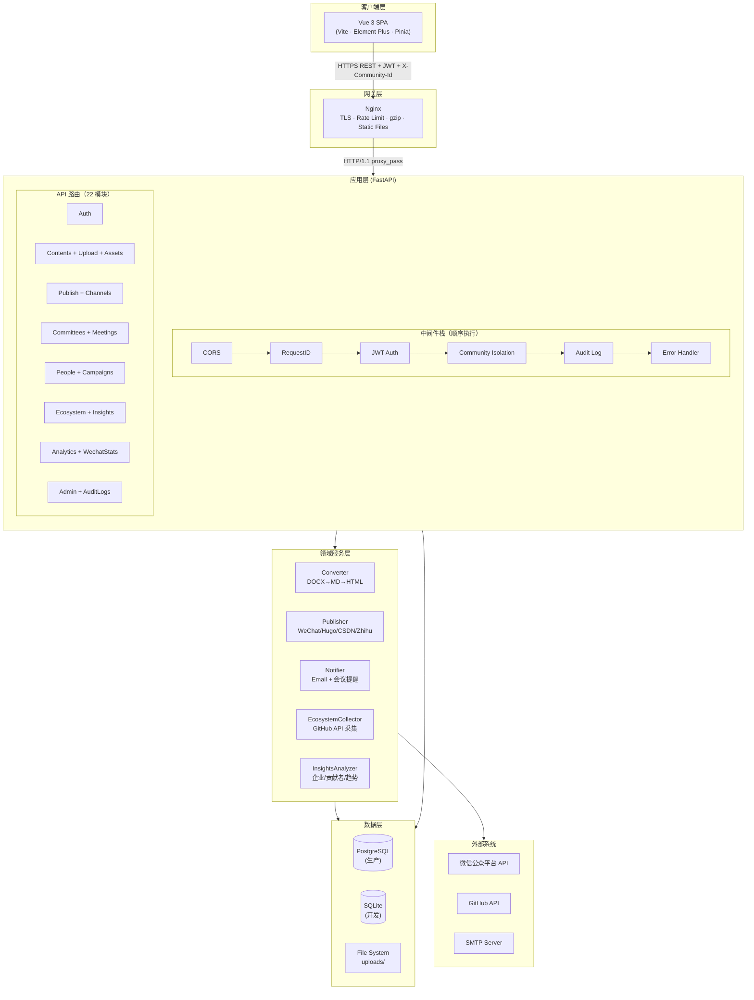
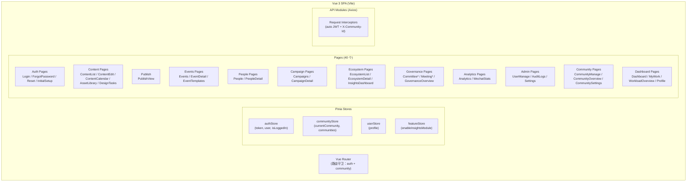
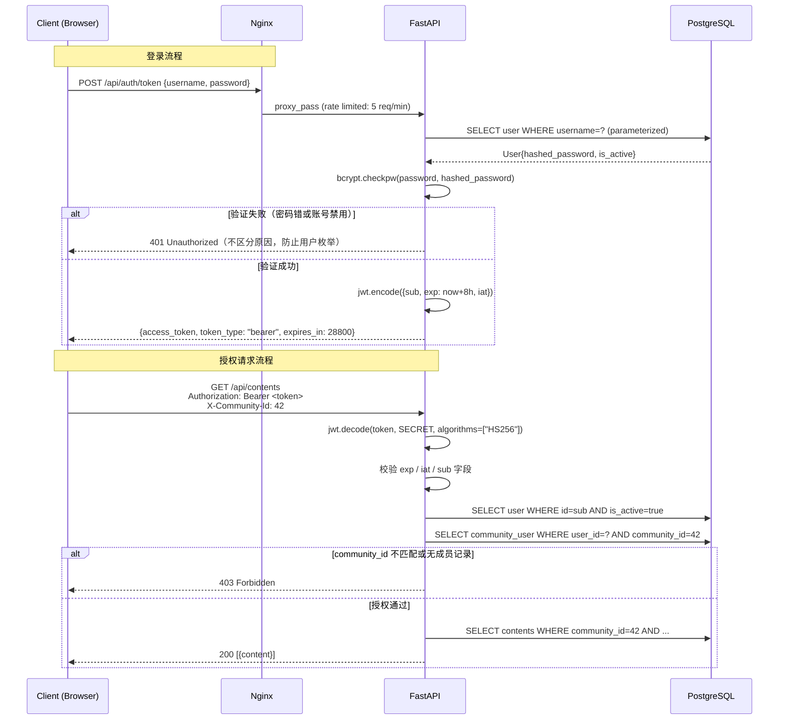
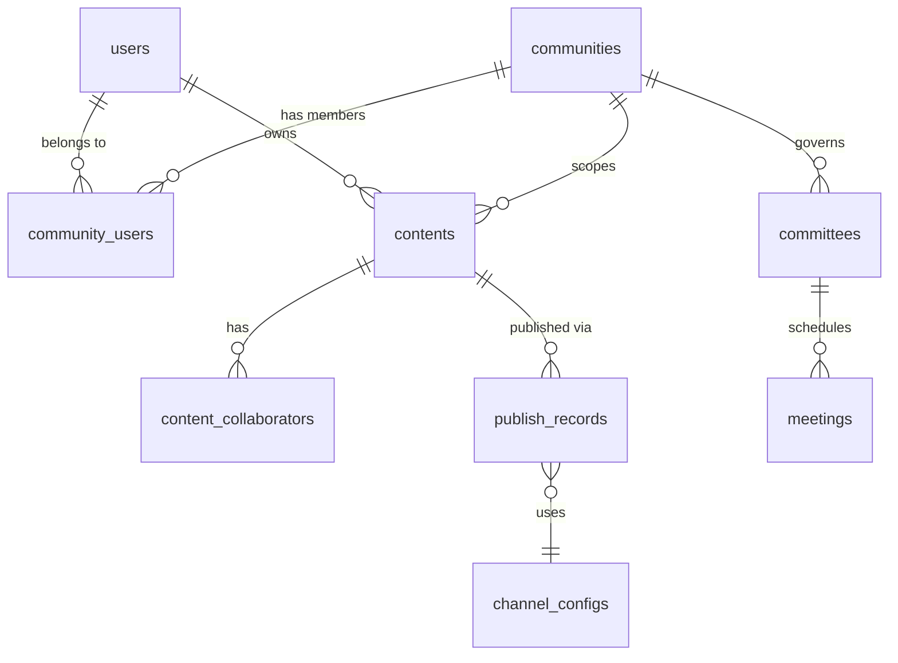
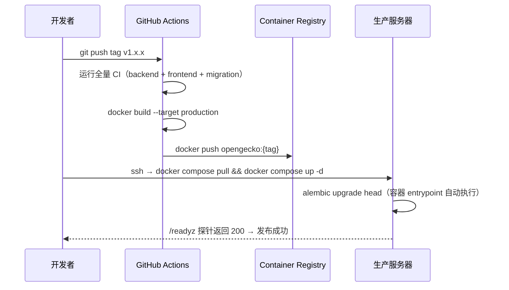

# openGecko - 系统架构设计文档

**项目名称**: openGecko - 多社区运营管理平台
**文档版本**: v5.0
**更新日期**: 2026-03-02
**架构风格**: 前后端分离 + 多租户 SaaS + 分层六边形架构
**品牌定位**: Manage All, Publish Everywhere

---

## 0. 架构决策记录（ADR）

| # | 决策 | 选型 | 主要理由 |
|---|------|------|----------|
| ADR-001 | Web 框架 | FastAPI + Uvicorn | 原生异步、自动 OpenAPI、基于类型注解的依赖注入，生产性能优于 Django REST |
| ADR-002 | ORM | SQLAlchemy 2.0 | 声明式映射、类型安全、支持异步引擎，Alembic 自动迁移 |
| ADR-003 | 前端框架 | Vue 3 + Composition API | `<script setup>` 模式下类型推断完整，Pinia 比 Vuex 更轻量 |
| ADR-004 | 多租户策略 | 共享数据库 + 行级隔离 | `community_id` 列过滤，部署成本低，租户规模可控 |
| ADR-005 | 认证方案 | JWT（无状态）+ bcrypt | 去除服务端 session 状态，水平扩展无需 sticky session |
| ADR-006 | 密钥管理 | Fernet（对称）+ 环境变量 | 对称加密满足凭证存储需求；密钥注入符合 12-Factor App 原则 |
| ADR-007 | 数据库选型 | SQLite（dev）/ PostgreSQL（prod）| 开发零配置；生产使用 pg 以获得并发写、JSONB、全文索引 |
| ADR-008 | 静态文件服务 | Nginx | 将静态资源从应用进程卸载，支持 gzip、缓存头和 range 请求 |

---

## 1. 架构概览

### 1.1 分层架构（C4 Container View）

```
┌──────────────────────────────────────────────────────────────────┐
│  Presentation Layer  │  Vue 3 SPA (Vite)  │  Element Plus         │
│                      │  Pinia · Axios     │  Vue Router           │
├──────────────────────┴────────────────────┴───────────────────────┤
│                          HTTP / REST (JSON)                        │
│                    Authorization: Bearer <JWT>                     │
│                    X-Community-Id: <community_id>                 │
├──────────────────────────────────────────────────────────────────┤
│  API Gateway Layer   │  Nginx (TLS termination, rate limit, gzip) │
├──────────────────────┴────────────────────────────────────────────┤
│  Application Layer   │  FastAPI + Uvicorn/Gunicorn                │
│  ┌────────────────────────────────────────────────────────────┐   │
│  │  Middleware Stack                                          │   │
│  │  CORSMiddleware → TrustedHostMiddleware → RequestIDMiddle  │   │
│  │  → JWTAuthMiddleware → CommunityIsolationMiddleware        │   │
│  │  → AuditLogMiddleware → ErrorHandlerMiddleware             │   │
│  └────────────────────────────────────────────────────────────┘   │
│  ┌──────────┐ ┌──────────┐ ┌──────────┐ ┌──────────┐            │
│  │ Auth API │ │Content API│ │Publish API│ │ Admin API│  ···       │
│  └──────────┘ └──────────┘ └──────────┘ └──────────┘            │
├──────────────────────────────────────────────────────────────────┤
│  Domain / Service Layer                                           │
│  ┌─────────────┐ ┌────────────┐ ┌──────────────┐ ┌───────────┐  │
│  │ContentService│ │PublishSvc  │ │EcosystemSvc  │ │ NotifSvc  │  │
│  └─────────────┘ └────────────┘ └──────────────┘ └───────────┘  │
├──────────────────────────────────────────────────────────────────┤
│  Infrastructure / Adapter Layer                                   │
│  ┌──────────┐ ┌──────────┐ ┌──────────┐ ┌──────────┐            │
│  │  WeChat  │ │   Hugo   │ │  GitHub  │ │   SMTP   │            │
│  │  Adapter │ │  Adapter │ │  Adapter │ │  Adapter │            │
│  └──────────┘ └──────────┘ └──────────┘ └──────────┘            │
├──────────────────────────────────────────────────────────────────┤
│  Data Layer                                                       │
│  ┌────────────────────┐  ┌──────────────┐  ┌──────────────────┐  │
│  │  PostgreSQL (prod) │  │  SQLite(dev) │  │   File System    │  │
│  │  SQLAlchemy 2.0    │  │  SQLAlchemy  │  │   uploads/       │  │
│  └────────────────────┘  └──────────────┘  └──────────────────┘  │
└──────────────────────────────────────────────────────────────────┘
```

### 1.2 总体架构图（Mermaid）


```mermaid
graph TB
    subgraph Client["客户端层"]
        Browser["Vue 3 SPA<br/>(Vite · Element Plus · Pinia)"]
    end

    subgraph Gateway["网关层"]
        Nginx["Nginx<br/>TLS · Rate Limit · gzip · Static Files"]
    end

    subgraph App["应用层 (FastAPI)"]
        direction TB
        subgraph MW["中间件栈（顺序执行）"]
            CORS["CORS"] --> RID["RequestID"] --> Auth["JWT Auth"]
            Auth --> CI["Community Isolation"] --> AL["Audit Log"]
            AL --> EH["Error Handler"]
        end
        subgraph Routers["API 路由（22 模块）"]
            AuthAPI["Auth"] 
            ContentAPI["Contents + Upload + Assets"]
            PublishAPI["Publish + Channels"]
            GovAPI["Committees + Meetings"]
            PeopleAPI["People + Campaigns"]
            EcoAPI["Ecosystem + Insights"]
            AnalyticsAPI["Analytics + WechatStats"]
            AdminAPI["Admin + AuditLogs"]
        end
    end

    subgraph Services["领域服务层"]
        direction LR
        ConvSvc["Converter<br/>DOCX→MD→HTML"]
        PubSvc["Publisher<br/>WeChat/Hugo/CSDN/Zhihu"]
        NotifSvc["Notifier<br/>Email + 会议提醒"]
        EcoSvc["EcosystemCollector<br/>GitHub API 采集"]
        InsightSvc["InsightsAnalyzer<br/>企业/贡献者/趋势"]
    end

    subgraph Data["数据层"]
        PG[("PostgreSQL<br/>(生产)")]
        SQLite[("SQLite<br/>(开发)")]
        FS["File System<br/>uploads/"]
    end

    subgraph External["外部系统"]
        WeChatAPI["微信公众平台 API"]
        GithubAPI["GitHub API"]
        SMTPServer["SMTP Server"]
    end

    Browser -->|"HTTPS REST + JWT + X-Community-Id"| Nginx
    Nginx -->|"HTTP/1.1 proxy_pass"| App
    App --> Services
    Services --> Data
    Services --> External
    App --> Data
```

### 1.3 核心设计原则

| 原则 | 实现方式 |
|------|----------|
| **关注点分离** | Router → Service → Repository 三层，路由层不含业务逻辑 |
| **依赖倒置** | 业务层通过抽象接口调用外部适配器，便于单元测试 Mock |
| **租户隔离** | 所有社区数据查询强制附加 `community_id` 过滤，中间件层验证 Header |
| **幂等性** | 发布操作携带 `idempotency_key`，防止网络重试导致重复发布 |
| **失败隔离** | 外部集成（WeChat/Email）异常不抛出 500，降级返回提示 |
| **最小权限** | RBAC 三级（superuser / admin / user），API 维度权限检查 |

### 1.2 前端架构图


```mermaid
graph TB
    subgraph Vue3["Vue 3 SPA (Vite)"]
        Router["Vue Router<br/>(路由守卫：auth + community)"]

        subgraph Stores["Pinia Stores"]
            AuthStore["authStore<br/>(token, user, isLoggedIn)"]
            CommunityStore["communityStore<br/>(currentCommunity, communities)"]
            UserStore["userStore<br/>(profile)"]
            FeatureStore["featureStore<br/>(enableInsightsModule)"]
        end

        subgraph Views["Pages (40 个)"]
            Auth["Auth Pages<br/>Login / ForgotPassword / Reset / InitialSetup"]
            Content["Content Pages<br/>ContentList / ContentEdit / ContentCalendar / AssetLibrary / DesignTasks"]
            Publish["Publish<br/>PublishView"]
            Events["Events Pages<br/>Events / EventDetail / EventTemplates"]
            People["People Pages<br/>People / PeopleDetail"]
            Campaign["Campaign Pages<br/>Campaigns / CampaignDetail"]
            Ecosystem["Ecosystem Pages<br/>EcosystemList / EcosystemDetail / InsightsDashboard"]
            Governance["Governance Pages<br/>Committee* / Meeting* / GovernanceOverview"]
            Analytics["Analytics Pages<br/>Analytics / WechatStats"]
            Admin["Admin Pages<br/>UserManage / AuditLogs / Settings"]
            Community["Community Pages<br/>CommunityManage / CommunityOverview / CommunitySettings"]
            Dashboard["Dashboard Pages<br/>Dashboard / MyWork / WorkloadOverview / Profile"]
        end

        subgraph API["API Modules (Axios)"]
            Interceptors["Request Interceptors<br/>(auto JWT + X-Community-Id)"]
        end
    end
```

---

## 2. 后端结构

### 2.1 目录结构

```
backend/app/
├── api/                    # FastAPI 路由层（22 个模块）
│   ├── auth.py             # POST /token, POST /users, GET /users/me
│   ├── communities.py      # CRUD /communities, /communities/{id}/members
│   ├── contents.py         # CRUD /contents, 状态流转, 协作者管理
│   ├── upload.py           # POST /contents/upload, POST /contents/{id}/cover
│   ├── assets.py           # CRUD /assets
│   ├── design_tasks.py     # CRUD /design-tasks
│   ├── publish.py          # POST /publish, GET /publish/records
│   ├── channels.py         # CRUD /channels
│   ├── committees.py       # CRUD /committees, /committees/{id}/members
│   ├── meetings.py         # CRUD /meetings, ICS 导出, 提醒
│   ├── events.py           # CRUD /events, 人员/签到/反馈
│   ├── event_templates.py  # CRUD /event-templates, 模板项管理
│   ├── people.py           # CRUD /people, 社区角色
│   ├── campaigns.py        # CRUD /campaigns, 联系人, 活动记录
│   ├── ecosystem.py        # CRUD /ecosystem, 快照, 贡献者
│   ├── analytics.py        # GET /analytics (内容/发布统计)
│   ├── wechat_stats.py     # CRUD /wechat-stats
│   ├── dashboard.py        # GET /users/me/dashboard 个人仪表板
│   ├── community_dashboard.py # GET /community-dashboard
│   ├── notifications.py    # CRUD /notifications
│   ├── admin.py            # 用户管理 (superuser only)
│   └── __init__.py
│
├── models/                 # SQLAlchemy ORM 模型（17 个模块，43 张表）
├── schemas/                # Pydantic v2 请求/响应 Schema
├── services/               # 业务逻辑与外部集成
│   ├── converter.py        # DOCX/MD → HTML 转换
│   ├── wechat.py           # 微信公众号 API
│   ├── hugo.py             # Hugo 文件生成
│   ├── csdn.py             # CSDN 格式适配
│   ├── zhihu.py            # 知乎格式适配
│   ├── ics.py              # ICS 日历文件生成
│   ├── email.py            # SMTP 邮件发送
│   ├── notification.py     # 会议提醒通知
│   └── ecosystem/          # 生态洞察服务
│       ├── collector.py    # GitHub API 数据采集
│       └── sync.py         # 定时同步调度
│
├── insights/               # 生态洞察分析器
│   └── analyzers/
│       ├── corporate.py    # 企业分布分析
│       ├── influence.py    # 贡献者影响力
│       └── trend.py        # 趋势分析
│
├── core/
│   ├── security.py         # JWT 创建/验证，bcrypt，Fernet 加密
│   ├── dependencies.py     # FastAPI Depends（认证、RBAC、社区隔离）
│   └── logging.py          # 结构化日志
│
├── config.py               # Pydantic Settings（读取 .env）
├── database.py             # DB 连接、Session 管理、init_db()
└── main.py                 # FastAPI app，注册所有路由
```

### 2.2 API 路由注册表

| 路由前缀 | 模块 | 说明 |
|---------|------|------|
| `/api/auth` | auth | 登录、注册、Token 刷新、初始化 |
| `/api/users` | auth, admin | 用户 CRUD，密码重置 |
| `/api/users/me` | dashboard | 个人仪表板（prefix: `/api/users/me`）|
| `/api/communities` | communities | 社区 CRUD，成员管理 |
| `/api/community-dashboard` | community_dashboard | 社区总览数据 |
| `/api/contents` | contents, upload | 内容 CRUD，文件上传（`/api/contents/upload`）|
| `/api/assets` | assets | 素材库 |
| `/api/design-tasks` | design_tasks | 设计任务 |
| `/api/publish` | publish | 多渠道发布，发布记录 |
| `/api/channels` | channels | 渠道配置 |
| `/api/committees` | committees | 委员会，委员会成员 |
| `/api/meetings` | meetings | 会议，ICS 导出，提醒 |
| `/api/events` | events | 活动，人员，签到，反馈 |
| `/api/event-templates` | event_templates | SOP 模板，模板项 |
| `/api/people` | people | 人脉档案，社区角色 |
| `/api/campaigns` | campaigns | Campaign，联系人，接触记录 |
| `/api/ecosystem` | ecosystem | 生态项目，快照，贡献者 |
| `/api/analytics` | analytics | 内容分析，发布统计 |
| `/api/wechat-stats` | wechat_stats | 微信数据统计 |
| `/api/notifications` | notifications | 系统通知 |
| `/api/admin` | admin | 平台管理（superuser only）|
| `/api/audit-logs` | audit | 审计日志 |

### 2.3 依赖注入链

```python
# 认证层
get_current_user(token: str = Depends(oauth2_scheme)) -> User
get_current_active_user(user = Depends(get_current_user)) -> User
get_current_active_superuser(user = Depends(get_current_active_user)) -> User

# 社区隔离层（返回 int，非 Community 对象）
get_current_community(x_community_id: int = Header(...)) -> int

# RBAC 层
get_community_admin(
    user = Depends(get_current_active_user),
    community_id = Depends(get_current_community),
    db = Depends(get_db)
) -> User

# 内容权限层
check_content_edit_permission(
    content_id: int,
    user = Depends(get_current_active_user),
    community_id = Depends(get_current_community),
    db = Depends(get_db)
) -> Content
```

---

## 3. 前端结构

### 3.1 页面路由结构

```
/ (重定向到 /dashboard)
├── /login              - 登录
├── /forgot-password    - 忘记密码
├── /reset-password     - 重置密码
├── /initial-setup      - 首次初始化（仅临时账号可访问）
│
└── （需要登录）
    ├── /dashboard          - 个人仪表板
    ├── /my-work            - 个人工作台
    ├── /profile            - 个人资料
    │
    ├── /contents           - 内容列表
    ├── /contents/calendar  - 内容日历
    ├── /contents/:id/edit  - 内容编辑
    ├── /publish            - 发布
    ├── /assets             - 素材库
    ├── /design-tasks       - 设计任务
    │
    ├── /events             - 活动列表
    ├── /events/:id         - 活动详情
    ├── /event-templates    - SOP 模板
    │
    ├── /people             - 人脉列表
    ├── /people/:id         - 人脉详情
    ├── /campaigns          - Campaign 列表
    ├── /campaigns/:id      - Campaign 详情
    │
    ├── /ecosystem          - 生态项目列表
    ├── /ecosystem/:id      - 生态项目详情
    ├── /insights           - 洞察仪表板
    │
    ├── /governance         - 治理总览
    ├── /committees         - 委员会列表
    ├── /committees/:id     - 委员会详情
    ├── /meetings/calendar  - 会议日历
    ├── /meetings/:id       - 会议详情
    │
    ├── /analytics          - 内容分析
    ├── /wechat-stats       - 微信数据统计
    ├── /workload           - 工作量总览（superuser）
    │
    ├── /community-overview - 社区总览
    ├── /community-manage   - 社区管理
    ├── /community-settings - 社区设置
    ├── /community-sandbox  - 沙箱
    │
    ├── /users              - 用户管理（superuser）
    ├── /audit-logs         - 审计日志（admin+）
    └── /settings           - 平台设置
```

### 3.2 Pinia Store 设计

| Store | 状态 | 说明 |
|-------|------|------|
| `authStore` | `token`, `user`, `isLoggedIn` | JWT Token 存 localStorage，自动附加到 Axios |
| `communityStore` | `currentCommunity`, `communities`, `communityId` | 当前社区，切换时触发 `X-Community-Id` 更新 |
| `userStore` | `profile` | 当前用户详情（含角色） |
| `featureStore` | `enableInsightsModule` | 功能开关，从后端拉取 |

### 3.3 Axios 拦截器

```typescript
// 请求拦截：自动附加认证和社区信息
axios.interceptors.request.use(config => {
  const token = authStore.token
  if (token) config.headers.Authorization = `Bearer ${token}`

  const communityId = communityStore.communityId
  if (communityId) config.headers['X-Community-Id'] = communityId

  return config
})

// 响应拦截：统一错误处理
axios.interceptors.response.use(
  response => response,
  error => {
    if (error.response?.status === 401) authStore.logout()
    return Promise.reject(error)
  }
)
```

---

## 4. 安全架构

参考 OWASP Top 10（2021）和 NIST SP 800-63B 身份认证标准进行设计。

### 4.1 威胁边界与防御层

```
┌─────────────────────────────────────────┐
│  Internet                                │
│         ↓ HTTPS (TLS 1.2+)              │
│  ┌──────────────────────────────────┐   │
│  │ Nginx Layer                      │   │
│  │  • Rate Limiting (10 req/s/IP)   │   │  ← DDoS / Brute Force
│  │  • HSTS / Secure Headers         │   │  ← Protocol Downgrade
│  │  • 隐藏服务器版本信息 (server_tokens off) │   │
│  └──────────────────────────────────┘   │
│         ↓ HTTP                          │
│  ┌──────────────────────────────────┐   │
│  │ FastAPI Middleware Layer         │   │
│  │  • CORS Whitelist                │   │  ← CSRF / Origin 劫持
│  │  • TrustedHost Middleware        │   │  ← Host Header 注入
│  │  • RequestID (tracing)           │   │
│  │  • JWT 验证 + 过期检测           │   │  ← 认证绕过
│  │  • Community Isolation 校验      │   │  ← 越权访问
│  └──────────────────────────────────┘   │
│         ↓                               │
│  ┌──────────────────────────────────┐   │
│  │ Business Logic Layer             │   │
│  │  • Pydantic Schema 输入验证      │   │  ← 注入攻击
│  │  • RBAC 权限检查                 │   │  ← 水平越权
│  │  • SQLAlchemy ORM（禁止裸 SQL）  │   │  ← SQL 注入
│  │  • 文件类型白名单验证            │   │  ← 文件上传攻击
│  └──────────────────────────────────┘   │
│         ↓                               │
│  ┌──────────────────────────────────┐   │
│  │ Data Layer                       │   │
│  │  • Fernet 加密渠道凭证           │   │  ← 数据泄露
│  │  • bcrypt (cost=12) 密码哈希     │   │  ← 彩虹表攻击
│  │  • 敏感字段审计日志              │   │  ← 不可否认性
│  └──────────────────────────────────┘   │
└─────────────────────────────────────────┘
```

### 4.2 认证与授权流程


```mermaid
sequenceDiagram
    participant C as Client (Browser)
    participant N as Nginx
    participant API as FastAPI
    participant DB as PostgreSQL

    Note over C,N: 登录流程
    C->>N: POST /api/auth/token {username, password}
    N->>API: proxy_pass (rate limited: 5 req/min)
    API->>DB: SELECT user WHERE username=? (parameterized)
    DB-->>API: User{hashed_password, is_active}
    API->>API: bcrypt.checkpw(password, hashed_password)
    alt 验证失败（密码错或账号禁用）
        API-->>C: 401 Unauthorized（不区分原因，防止用户枚举）
    else 验证成功
        API->>API: jwt.encode({sub, exp: now+8h, iat})
        API-->>C: {access_token, token_type: "bearer", expires_in: 28800}
    end

    Note over C,API: 授权请求流程
    C->>API: GET /api/contents<br/>Authorization: Bearer <token><br/>X-Community-Id: 42
    API->>API: jwt.decode(token, SECRET, algorithms=["HS256"])
    API->>API: 校验 exp / iat / sub 字段
    API->>DB: SELECT user WHERE id=sub AND is_active=true
    API->>DB: SELECT community_user WHERE user_id=? AND community_id=42
    alt community_id 不匹配或无成员记录
        API-->>C: 403 Forbidden
    else 授权通过
        API->>DB: SELECT contents WHERE community_id=42 AND ...
        API-->>C: 200 [{content}]
    end
```

### 4.3 RBAC 权限矩阵

| 操作 | superuser | admin（社区管理员） | user（社区成员） |
|------|:---------:|:------------------:|:--------------:|
| 访问平台所有社区 | ✅ | ❌ | ❌ |
| 创建/删除社区 | ✅ | ❌ | ❌ |
| 管理社区成员 | ✅ | ✅ | ❌ |
| 发布内容到渠道 | ✅ | ✅ | ❌ |
| 创建/编辑内容 | ✅ | ✅ | ✅（仅自己或协作者）|
| 查看审计日志 | ✅ | ✅ | ❌ |
| 管理渠道配置 | ✅ | ✅ | ❌ |
| 工作量总览 | ✅ | ❌ | ❌ |

**依赖注入链（精确度优先，从左到右权限递增）：**

```python
# backend/app/core/dependencies.py

# L1: 令牌解码 + 用户激活态校验
async def get_current_user(token: str = Depends(oauth2_scheme), db: Session = Depends(get_db)) -> User:
    try:
        payload = jwt.decode(token, settings.SECRET_KEY, algorithms=["HS256"])
        user_id: int = payload.get("sub")
    except JWTError:
        raise HTTPException(status_code=401, detail="无效的认证令牌")
    user = db.get(User, user_id)
    if not user or not user.is_active:
        raise HTTPException(status_code=401, detail="用户不存在或已禁用")
    return user

# L2: 社区隔离（返回 int，非对象，避免额外 DB 查询）
def get_current_community(x_community_id: int = Header(..., alias="X-Community-Id")) -> int:
    return x_community_id

# L3: 社区管理员校验
async def get_community_admin(
    user: User = Depends(get_current_active_user),
    community_id: int = Depends(get_current_community),
    db: Session = Depends(get_db),
) -> User:
    membership = db.query(CommunityUser).filter_by(
        user_id=user.id, community_id=community_id
    ).first()
    if not membership or membership.role not in ("admin", "superuser"):
        raise HTTPException(status_code=403, detail="需要社区管理员权限")
    return user

# L4: 内容级权限（owner / collaborator / admin / superuser 均可编辑）
async def check_content_edit_permission(content_id: int, ...) -> Content:
    content = db.query(Content).filter_by(id=content_id, community_id=community_id).first()
    if not content:
        raise HTTPException(status_code=404)
    allowed = (
        content.owner_id == user.id
        or user.id in [c.user_id for c in content.collaborators]
        or is_community_admin(user, community_id, db)
    )
    if not allowed:
        raise HTTPException(status_code=403)
    return content
```

### 4.4 渠道凭证加密（Fernet）

```python
# backend/app/core/security.py

import base64, hashlib
from cryptography.fernet import Fernet

def _derive_fernet_key(secret: str) -> bytes:
    """从 JWT_SECRET_KEY 派生 32 字节 URL-safe base64 key（确定性派生，无需额外存储 key）"""
    digest = hashlib.sha256(secret.encode()).digest()
    return base64.urlsafe_b64encode(digest)

def encrypt_credential(value: str, secret: str) -> str:
    return Fernet(_derive_fernet_key(secret)).encrypt(value.encode()).decode()

def decrypt_credential(token: str, secret: str) -> str:
    return Fernet(_derive_fernet_key(secret)).decrypt(token.encode()).decode()

def mask_credential(value: str) -> str:
    """API 响应脱敏：显示末 4 位，防止凭证全量暴露"""
    return "****" + value[-4:] if len(value) > 4 else "****"
```

### 4.5 输入验证与注入防护

```python
# Pydantic Schema 示例：前端传入数据强制校验
class ContentCreate(BaseModel):
    title:      str       = Field(..., min_length=1, max_length=200, strip_whitespace=True)
    body:       str       = Field(..., max_length=500_000)
    tags:       list[str] = Field(default=[], max_length=20)
    cover_url:  HttpUrl | None = None   # URL 格式校验

# 文件上传白名单（backend/app/api/upload.py）
ALLOWED_MIME_TYPES = {"image/jpeg", "image/png", "image/gif", "image/webp"}
MAX_FILE_SIZE = 10 * 1024 * 1024  # 10 MB

async def validate_upload(file: UploadFile):
    if file.content_type not in ALLOWED_MIME_TYPES:
        raise HTTPException(400, "不支持的文件类型")
    content = await file.read()
    if len(content) > MAX_FILE_SIZE:
        raise HTTPException(413, "文件超过 10MB 限制")
    # 使用随机文件名，防止路径遍历
    ext = MIME_TO_EXT[file.content_type]
    filename = f"{uuid4().hex}{ext}"
    return filename, content
```

### 4.6 安全响应头（Nginx）

```nginx
# /etc/nginx/conf.d/security-headers.conf
add_header Strict-Transport-Security "max-age=31536000; includeSubDomains" always;
add_header X-Content-Type-Options    "nosniff" always;
add_header X-Frame-Options           "DENY" always;
add_header Referrer-Policy           "strict-origin-when-cross-origin" always;
add_header Content-Security-Policy   "default-src 'self'; script-src 'self'; img-src 'self' data: blob:" always;
server_tokens off;
```

---

## 5. 可观测性（Observability）

参考 OpenTelemetry 三大支柱（Traces / Metrics / Logs）设计。

### 5.1 可观测性全景

```
┌──────────────────────────────────────────────────────────────────┐
│                   openGecko 可观测性体系                          │
│                                                                  │
│  ┌─────────────────────────────────────────────────────────┐    │
│  │ 埋点层（Instrumentation）                                │    │
│  │  FastAPI middleware → 注入 X-Request-ID                 │    │
│  │  结构化 JSON 日志（每条日志含 request_id, community_id） │    │
│  │  /health, /readyz 探针端点                              │    │
│  └─────────────────────────────────────────────────────────┘    │
│                          ↓                                       │
│  ┌──────────────┐  ┌──────────────┐  ┌──────────────────────┐   │
│  │   Logs       │  │   Metrics    │  │   Traces             │   │
│  │  结构化日志  │  │  Prometheus  │  │  OpenTelemetry SDK   │   │
│  │  JSON Lines  │  │  /metrics    │  │  (可选，生产开启)    │   │
│  └──────────────┘  └──────────────┘  └──────────────────────┘   │
│                                                                  │
│  可视化（可选部署）：Grafana / Loki / Tempo                       │
└──────────────────────────────────────────────────────────────────┘
```

### 5.2 结构化日志

所有日志输出 JSON 格式，包含固定字段集，便于 ELK/Loki 解析：

```python
# backend/app/core/logging.py
import logging, json, time
from contextvars import ContextVar

request_id_ctx: ContextVar[str] = ContextVar("request_id", default="-")
community_id_ctx: ContextVar[int] = ContextVar("community_id", default=0)

class JSONFormatter(logging.Formatter):
    def format(self, record: logging.LogRecord) -> str:
        return json.dumps({
            "ts":           time.strftime("%Y-%m-%dT%H:%M:%SZ", time.gmtime()),
            "level":        record.levelname,
            "logger":       record.name,
            "msg":          record.getMessage(),
            "request_id":   request_id_ctx.get(),
            "community_id": community_id_ctx.get(),
            "module":       record.module,
            "line":         record.lineno,
            **(record.__dict__.get("extra", {})),
        }, ensure_ascii=False)

# 示例日志输出
# {"ts":"2026-03-02T08:00:00Z","level":"INFO","logger":"app.api.contents",
#  "msg":"内容创建成功","request_id":"abc-123","community_id":42,"content_id":789}
```

**日志级别规范：**

| 级别 | 使用场景 |
|------|----------|
| `DEBUG` | 开发调试，生产禁止 |
| `INFO` | 关键业务操作（内容创建/发布/登录成功） |
| `WARNING` | 可恢复的异常（外部 API 超时，降级处理） |
| `ERROR` | 需要介入的错误（DB 连接失败，未捕获异常） |
| `CRITICAL` | 导致服务不可用的故障 |

### 5.3 健康检查端点

```python
# backend/app/api/health.py

@router.get("/health", tags=["ops"])
def liveness() -> dict:
    """Kubernetes liveness probe：进程存活即返回 200"""
    return {"status": "ok", "version": settings.APP_VERSION}

@router.get("/readyz", tags=["ops"])
def readiness(db: Session = Depends(get_db)) -> dict:
    """Kubernetes readiness probe：校验 DB 连通性"""
    try:
        db.execute(text("SELECT 1"))
        db_ok = True
    except Exception:
        db_ok = False
    status = "ready" if db_ok else "not_ready"
    code   = 200    if db_ok else 503
    return JSONResponse({"status": status, "db": db_ok}, status_code=code)
```

**探针配置（Docker Compose）：**

```yaml
healthcheck:
  test: ["CMD", "curl", "-f", "http://localhost:8000/health"]
  interval: 30s
  timeout:  5s
  retries:  3
  start_period: 10s
```

### 5.4 请求追踪（Request ID）

```python
# backend/app/middleware/request_id.py
import uuid
from starlette.middleware.base import BaseHTTPMiddleware

class RequestIDMiddleware(BaseHTTPMiddleware):
    async def dispatch(self, request, call_next):
        req_id = request.headers.get("X-Request-ID") or uuid.uuid4().hex
        request_id_ctx.set(req_id)
        response = await call_next(request)
        response.headers["X-Request-ID"] = req_id   # 透传回客户端
        return response
```

客户端可通过 `X-Request-ID` 响应头关联请求与日志，便于全链路排查。

### 5.5 审计日志

所有写操作（CREATE / UPDATE / DELETE）及敏感操作（LOGIN / PUBLISH / ROLE_CHANGE）均写入 `audit_logs` 表：

```sql
CREATE TABLE audit_logs (
    id           SERIAL PRIMARY KEY,
    created_at   TIMESTAMPTZ NOT NULL DEFAULT NOW(),
    user_id      INT REFERENCES users(id),
    community_id INT REFERENCES communities(id),
    action       VARCHAR(50)  NOT NULL,  -- e.g. "content.create"
    resource     VARCHAR(50)  NOT NULL,  -- e.g. "content"
    resource_id  INT,
    detail       JSONB,                  -- 变更前后 diff（生产可选）
    ip_address   INET,
    request_id   VARCHAR(64)
);
-- 高频查询索引
CREATE INDEX idx_audit_community_created ON audit_logs(community_id, created_at DESC);
CREATE INDEX idx_audit_user_created      ON audit_logs(user_id, created_at DESC);
```

---

## 6. 外部集成

### 6.1 微信公众号

- **接口**：微信公众平台 API（`api.weixin.qq.com`）
- **能力**：获取 access_token、上传图片素材、创建草稿
- **凭证**：AppID + AppSecret（Fernet 加密存储）
- **限制**：access_token 有效期 7200 秒，自动刷新

### 6.2 Hugo 博客

- **集成方式**：本地文件系统操作
- **能力**：在指定路径生成 `.md` 文件（含 front matter：title、date、categories、tags、cover）
- **凭证**：博客仓库绝对路径（不加密，非敏感）

### 6.3 CSDN / 知乎

- **集成方式**：返回格式化内容供用户复制，无自动发布
- **凭证**：Cookie（Fernet 加密存储，用于标识用户，未自动提交）

### 6.4 GitHub API（生态洞察）

- **接口**：`api.github.com`
- **能力**：获取仓库信息（stars、forks、open issues、contributors）
- **凭证**：Personal Access Token（可选，`GITHUB_TOKEN` 环境变量）

### 6.5 SMTP 邮件

- **用途**：密码重置邮件、会议提醒邮件
- **配置**：`SMTP_HOST`、`SMTP_PORT`、`SMTP_USER`、`SMTP_PASSWORD`
- **实现**：同步发送（`smtplib`），错误记录日志但不影响主流程

---

## 7. 数据模型设计原则

### 7.1 多租户行级隔离

所有社区范围的表均有 `community_id NOT NULL` 列，并在该列上建立复合索引：

```sql
-- 典型表结构示例
CREATE TABLE contents (
    id              SERIAL       PRIMARY KEY,
    community_id    INT          NOT NULL REFERENCES communities(id) ON DELETE CASCADE,
    owner_id        INT          NOT NULL REFERENCES users(id),
    created_by_user_id INT       NOT NULL REFERENCES users(id),
    title           VARCHAR(200) NOT NULL,
    body            TEXT,
    status          VARCHAR(20)  NOT NULL DEFAULT 'draft',
    work_status     VARCHAR(20)  NOT NULL DEFAULT 'pending',
    published_at    TIMESTAMPTZ,
    created_at      TIMESTAMPTZ  NOT NULL DEFAULT NOW(),
    updated_at      TIMESTAMPTZ  NOT NULL DEFAULT NOW()
);
-- 最常用查询路径的复合索引
CREATE INDEX idx_contents_community_status ON contents(community_id, status);
CREATE INDEX idx_contents_community_owner  ON contents(community_id, owner_id);
CREATE INDEX idx_contents_community_created ON contents(community_id, created_at DESC);
```

### 7.2 软删除策略

关键业务表（`users`、`contents`、`communities`）使用 `deleted_at` 软删除，保留数据用于审计和恢复：

```python
# SQLAlchemy Mixin
class SoftDeleteMixin:
    deleted_at: Mapped[datetime | None] = mapped_column(nullable=True, index=True)

    @classmethod
    def active(cls, query):
        """过滤器：仅返回未删除记录"""
        return query.filter(cls.deleted_at.is_(None))
```

### 7.3 时间戳规范

| 字段 | 类型 | 说明 |
|------|------|------|
| `created_at` | `TIMESTAMPTZ` | 创建时间，由数据库 `DEFAULT NOW()` 填充 |
| `updated_at` | `TIMESTAMPTZ` | 更新时间，SQLAlchemy `onupdate` 自动维护 |
| `deleted_at` | `TIMESTAMPTZ NULL` | 软删除时间戳 |
| `published_at` | `TIMESTAMPTZ NULL` | 业务发布时间（与 created_at 区分）|

所有时间戳统一使用 UTC（`TIMESTAMPTZ`），前端负责转换为本地时区显示。

### 7.4 关键表关系（ERD 局部）


```mermaid
erDiagram
    communities ||--o{ community_users : "has members"
    communities ||--o{ contents : "scopes"
    users       ||--o{ community_users : "belongs to"
    users       ||--o{ contents : "owns"
    contents    ||--o{ content_collaborators : "has"
    contents    ||--o{ publish_records : "published via"
    publish_records }o--|| channel_configs : "uses"
    committees  ||--o{ meetings : "schedules"
    communities ||--o{ committees : "governs"
```

### 7.5 索引策略

| 表 | 索引列 | 类型 | 目的 |
|----|--------|------|------|
| `contents` | `(community_id, status)` | BTREE | 内容列表分页 |
| `contents` | `(community_id, owner_id)` | BTREE | 个人工作台 |
| `audit_logs` | `(community_id, created_at DESC)` | BTREE | 审计日志翻页 |
| `publish_records` | `(content_id, created_at DESC)` | BTREE | 发布历史 |
| `meetings` | `(community_id, start_time)` | BTREE | 会议日历查询 |
| `users` | `email` | UNIQUE | 登录唯一性 |

---

## 8. 部署架构

### 8.1 环境矩阵

| 维度 | 开发环境 | 生产环境 |
|------|---------|---------|
| 运行方式 | 本地直接启动 | Docker Compose |
| 应用服务器 | Uvicorn（单进程，热重载） | Gunicorn + UvicornWorker（4 workers）|
| 数据库 | SQLite（零配置） | PostgreSQL 15 |
| 静态文件 | Vite Dev Server（HMR） | Nginx 静态服务 |
| API 代理 | Vite proxy `/api → :8000` | Nginx `proxy_pass` |
| 文件存储 | `./backend/uploads/`（本地） | Docker volume（`./uploads`）|
| 配置来源 | `.env` 文件 | Docker secrets / 环境变量注入 |

### 8.2 开发环境启动

```bash
# 一键启动（推荐）
make dev                  # 并发启动 backend + frontend

# 分开启动
make dev-backend          # uvicorn app.main:app --reload  →  :8000
make dev-frontend         # vite                           →  :3000
```

```
localhost:3000  (Vite Dev Server)
    │
    ├── /          → Vue 3 SPA (HMR)
    └── /api/**    → proxy → localhost:8000
                              │
                         FastAPI (Uvicorn)
                              │
                         SQLite: ./backend/opengecko.db
                         uploads/: ./backend/uploads/
```

### 8.3 生产环境（Docker Compose）

**流量链路：**

```
Client
  │  HTTPS (TLS 1.2+, 由外部负载均衡或 Certbot 终止)
  ▼
Nginx :80/:443
  ├── location /          → /usr/share/nginx/html (Vue 静态文件, gzip)
  ├── location /api/      → proxy_pass http://backend:8000
  │     proxy_set_header  X-Real-IP / X-Forwarded-For / Host
  └── location /uploads/  → alias /app/uploads/ (本地文件直出)

backend (Gunicorn)
  workers = 4 × UvicornWorker
  └── PostgreSQL :5432
        volume: pg_data
```

**docker-compose.prod.yml 关键配置：**

```yaml
services:
  backend:
    image: opengecko-backend:${TAG:-latest}
    restart: unless-stopped
    command: >
      gunicorn app.main:app
        --workers 4
        --worker-class uvicorn.workers.UvicornWorker
        --bind 0.0.0.0:8000
        --timeout 120
        --access-logfile -
        --error-logfile -
    environment:
      - DATABASE_URL=postgresql://pg:pg@db:5432/opengecko
      - SECRET_KEY=${SECRET_KEY}          # 从宿主机环境变量注入
    volumes:
      - ./uploads:/app/uploads
      - ./data:/app/data
    depends_on:
      db:
        condition: service_healthy        # 等待 DB 就绪再启动
    healthcheck:
      test: ["CMD", "curl", "-f", "http://localhost:8000/health"]
      interval: 30s
      timeout: 5s
      retries: 3
      start_period: 15s
    deploy:
      resources:
        limits:
          cpus: "1.0"
          memory: 1G

  frontend:
    image: opengecko-frontend:${TAG:-latest}
    restart: unless-stopped
    ports:
      - "80:80"
      - "443:443"
    volumes:
      - ./nginx.conf:/etc/nginx/conf.d/default.conf:ro
      - /etc/letsencrypt:/etc/letsencrypt:ro  # Certbot 证书

  db:
    image: postgres:15-alpine
    restart: unless-stopped
    environment:
      POSTGRES_DB:       opengecko
      POSTGRES_USER:     pg
      POSTGRES_PASSWORD: ${POSTGRES_PASSWORD}
    volumes:
      - pg_data:/var/lib/postgresql/data
    healthcheck:
      test: ["CMD-SHELL", "pg_isready -U pg -d opengecko"]
      interval: 10s
      timeout: 5s
      retries: 5

volumes:
  pg_data:
```

### 8.4 Nginx 配置要点

```nginx
# /etc/nginx/conf.d/default.conf
server {
    listen 80;
    server_name _;
    return 301 https://$host$request_uri;   # 强制 HTTPS
}

server {
    listen 443 ssl http2;

    # TLS
    ssl_certificate     /etc/letsencrypt/live/example.com/fullchain.pem;
    ssl_certificate_key /etc/letsencrypt/live/example.com/privkey.pem;
    ssl_protocols       TLSv1.2 TLSv1.3;

    # 安全响应头（见 4.6 节）
    include /etc/nginx/conf.d/security-headers.conf;

    # Vue SPA：所有路由回退到 index.html
    location / {
        root  /usr/share/nginx/html;
        index index.html;
        try_files $uri $uri/ /index.html;
        expires 7d;                         # 静态资源长缓存
        add_header Cache-Control "public";
    }

    # API 反向代理
    location /api/ {
        proxy_pass         http://backend:8000;
        proxy_set_header   Host              $host;
        proxy_set_header   X-Real-IP         $remote_addr;
        proxy_set_header   X-Forwarded-For   $proxy_add_x_forwarded_for;
        proxy_set_header   X-Forwarded-Proto $scheme;
        proxy_read_timeout 120s;
        client_max_body_size 15M;           # 覆盖文件上传 10MB 限制
    }

    # 上传文件直出（绕过 FastAPI，Nginx 直接 serve）
    location /uploads/ {
        alias /app/uploads/;
        expires 30d;
        add_header Cache-Control "public, immutable";
    }
}

---

## 9. 数据库迁移策略

- **工具**：Alembic
- **当前状态**：单一初始迁移文件 `001_initial_schema.py`（revision: `001_initial_schema`），创建全部 43 张表
- **命名规范**：新迁移文件统一使用 `NNN_description.py` 格式（三位数字 + 英文小写下划线），如 `002_add_xxx.py`
- **执行**：`alembic upgrade head`（全新安装）；`alembic downgrade -1` + `alembic upgrade head`（回滚重试）
- **SQLite 兼容**：使用 Alembic batch mode 处理 SQLite 的 ALTER TABLE 限制

---

## 10. CI/CD 流水线

### 10.1 流水线总览

```
代码推送 / PR 创建
        │
        ├─── backend-ci          ── Lint → Type Check → Test (coverage ≥ 80%)
        ├─── frontend-ci         ── Type Check → Build
        ├─── database-migration  ── up → down → up (幂等性验证)
        └─── pr-checks           ── 提交规范 / squash 合规
                │
                │  全部通过
                ▼
        Merge to main
                │
                ▼
        (手动/自动) docker build & push → 部署
```

### 10.2 Backend CI（`backend-ci.yml`）

```yaml
# .github/workflows/backend-ci.yml
jobs:
  lint-and-test:
    runs-on: ubuntu-latest
    steps:
      - uses: actions/checkout@v4

      - uses: actions/setup-python@v5
        with: { python-version: "3.11" }

      - name: 安装依赖（缓存加速）
        uses: actions/cache@v4
        with:
          path: ~/.cache/pip
          key: pip-${{ hashFiles('backend/requirements*.txt') }}
      - run: pip install -r backend/requirements.txt -r backend/requirements-dev.txt

      - name: 代码格式检查（black）
        run: cd backend && black --check app/ tests/

      - name: Lint（ruff）
        run: cd backend && ruff check app/ --output-format=github

      - name: 类型检查（mypy）
        run: cd backend && mypy app/ --ignore-missing-imports

      - name: 单元 + 集成测试（≥ 80% 覆盖率）
        run: cd backend && pytest --cov=app --cov-fail-under=80 --cov-report=xml -q

      - name: 上传覆盖率报告
        uses: codecov/codecov-action@v4
        with: { files: backend/coverage.xml }
```

**质量门禁：**

| 检查项 | 工具 | 失败行为 |
|--------|------|---------|
| 代码格式 | black | PR 阻断 |
| Import 排序 | ruff I001 | PR 阻断 |
| Lint 规则 | ruff | PR 阻断 |
| 类型注解 | mypy | PR 阻断 |
| 测试覆盖率 | pytest-cov | < 80% 阻断 |
| 安全扫描 | bandit（pre-commit） | 本地阻断 |

### 10.3 Frontend CI（`frontend-ci.yml`）

```yaml
jobs:
  build:
    runs-on: ubuntu-latest
    steps:
      - uses: actions/checkout@v4
      - uses: actions/setup-node@v4
        with: { node-version: "20", cache: "npm", cache-dependency-path: frontend/package-lock.json }

      - run: cd frontend && npm ci          # 严格锁版本安装

      - name: TypeScript 类型检查
        run: cd frontend && npx vue-tsc --noEmit

      - name: 生产构建
        run: cd frontend && npx vite build  # 构建失败 = CI 失败
```

### 10.4 数据库迁移检查（`database-migration-check.yml`）

```yaml
jobs:
  migration:
    runs-on: ubuntu-latest
    steps:
      - uses: actions/checkout@v4
      - uses: actions/setup-python@v5
        with: { python-version: "3.11" }
      - run: pip install -r backend/requirements.txt

      - name: 验证迁移可正向执行
        run: cd backend && alembic upgrade head

      - name: 验证迁移可回滚
        run: cd backend && alembic downgrade -1

      - name: 验证幂等性（二次升级）
        run: cd backend && alembic upgrade head

      - name: 检测多 head（merge 冲突）
        run: |
          HEADS=$(cd backend && alembic heads | wc -l)
          if [ "$HEADS" -gt 1 ]; then
            echo "❌ 存在多个 migration head，请先执行 alembic merge"
            exit 1
          fi

      - name: 文件命名规范校验（NNN_ 格式）
        run: |
          cd backend/alembic/versions
          for f in *.py; do
            [[ "$f" =~ ^[0-9]{3}_[a-z0-9_]+\.py$ ]] || \
            [[ "$f" =~ ^[0-9a-f]{12}_[a-z0-9_]+\.py$ ]] || \
            { echo "❌ 命名不规范: $f"; exit 1; }
          done
```

### 10.5 发布流程（手动触发）


```mermaid
sequenceDiagram
    participant Dev as 开发者
    participant GH  as GitHub Actions
    participant Reg as Container Registry
    participant Srv as 生产服务器

    Dev->>GH: git push tag v1.x.x
    GH->>GH: 运行全量 CI（backend + frontend + migration）
    GH->>GH: docker build --target production
    GH->>Reg: docker push opengecko:{tag}
    Dev->>Srv: ssh → docker compose pull && docker compose up -d
    Srv->>Srv: alembic upgrade head（容器 entrypoint 自动执行）
    Srv-->>Dev: /readyz 探针返回 200 → 发布成功
```

`entrypoint.sh` 确保每次容器启动自动执行迁移：

```bash
#!/bin/sh
set -e
echo "Running DB migrations..."
alembic upgrade head
echo "Starting server..."
exec "$@"
```

---

## 11. 性能与扩展性

### 11.1 当前性能约束与目标

| 指标 | 当前目标（单节点） | 扩展后目标 |
|------|:-----------------:|:----------:|
| API P99 延迟 | < 500 ms | < 200 ms |
| 并发用户数 | 50 | 500+ |
| 内容列表吞吐 | 100 req/s | 1000 req/s |
| 文件上传大小 | 10 MB/file | 50 MB/file |

### 11.2 数据库性能优化

```python
# 1. 连接池配置（backend/app/database.py）
engine = create_engine(
    settings.DATABASE_URL,
    pool_size=10,          # 常驻连接数
    max_overflow=20,       # 超出 pool_size 后允许新开的连接
    pool_timeout=30,       # 等待连接超时
    pool_recycle=1800,     # 30 分钟回收连接，防止 DB 断开
    pool_pre_ping=True,    # 使用前探活，避免 stale connection
)

# 2. 避免 N+1：使用 selectinload 预加载关联
contents = (
    db.query(Content)
    .options(
        selectinload(Content.collaborators),
        selectinload(Content.publish_records)
    )
    .filter(Content.community_id == community_id)
    .offset(skip).limit(limit)
    .all()
)

# 3. 分页：keyset（游标）分页比 OFFSET 更高效（大表场景）
# OFFSET 分页（当前实现，适合小数据量）
.offset((page - 1) * page_size).limit(page_size)
# Keyset 分页（大数据量优化方向）
.filter(Content.id < last_seen_id).limit(page_size)
```

### 11.3 外部调用优化

```python
# 微信 access_token 本地缓存（避免每次请求都调外部 API）
class WeChatTokenCache:
    _token:      str | None = None
    _expires_at: float      = 0

    def get_token(self, appid: str, secret: str) -> str:
        if time.time() < self._expires_at - 60:   # 提前 60s 刷新
            return self._token
        resp = httpx.get(WECHAT_TOKEN_URL, params={"appid": appid, "secret": secret})
        data = resp.json()
        self._token      = data["access_token"]
        self._expires_at = time.time() + data["expires_in"]
        return self._token

# GitHub API 请求：设置超时 + 重试，防止采集任务卡死
transport = httpx.HTTPTransport(retries=3)
client    = httpx.Client(transport=transport, timeout=10.0)
```

### 11.4 文件上传优化

```python
# 流式读取 + 分块写盘，避免大文件 OOM
async def save_upload(file: UploadFile, dest: Path) -> int:
    total = 0
    with dest.open("wb") as f:
        while chunk := await file.read(64 * 1024):  # 64KB chunks
            if total + len(chunk) > MAX_FILE_SIZE:
                dest.unlink(missing_ok=True)
                raise HTTPException(413, "文件超过限制")
            f.write(chunk)
            total += len(chunk)
    return total
```

### 11.5 水平扩展路径

```
当前（单节点）          → 扩展阶段 1            → 扩展阶段 2
────────────────────────────────────────────────────────────────
Gunicorn 4 workers       Gunicorn 4 workers ×N   async FastAPI + async SQLAlchemy
PostgreSQL (单实例)   →  PostgreSQL (主从读分离)  → PostgreSQL 连接池 (PgBouncer)
本地 uploads/         →  S3/OSS 对象存储         → CDN 加速静态资源
无缓存                →  Redis 缓存热点数据      → Redis Cluster
进程内 token 缓存     →  Redis 共享缓存          → Redis + TTL 策略
```

**当前设计的扩展约束：**
- WeChat token 使用进程内缓存，多进程/多节点时需迁移到 Redis
- 文件存储使用本地磁盘，多节点部署需迁移到对象存储（MinIO / S3）
- 无显式缓存层，数据库成为唯一热点
