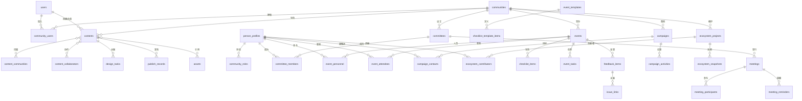

# openGecko - 数据库详细设计文档

**项目名称**: openGecko - 多社区运营管理平台
**文档版本**: v4.0
**更新日期**: 2026-03-02
**数据库**: SQLite（开发）/ PostgreSQL（生产）
**ORM**: SQLAlchemy 2.0 + Alembic 迁移

---

## 1. 概览

### 1.1 表清单（共 43 张）

| 域 | 表名 | 说明 |
|----|------|------|
| **用户与认证** | `users` | 平台用户 |
| | `password_reset_tokens` | 密码重置 Token |
| **社区** | `communities` | 社区 |
| | `community_users` | 用户-社区关联（含角色） |
| **内容** | `contents` | 内容文章 |
| | `content_communities` | 内容-社区多对多 |
| | `content_collaborators` | 内容协作者 |
| | `content_assignees` | 内容负责人 |
| | `content_analytics` | 内容分析数据 |
| **素材** | `assets` | 素材库（图片/文档） |
| | `content_assets` | 内容-素材关联 |
| **设计** | `design_tasks` | 设计任务 |
| **发布** | `publish_records` | 发布记录 |
| | `channel_configs` | 渠道配置（加密凭证） |
| **活动** | `events` | 活动 |
| | `event_communities` | 活动-社区多对多 |
| | `event_templates` | SOP 模板 |
| | `checklist_template_items` | 模板 Checklist 项 |
| | `checklist_items` | 活动 Checklist 项 |
| | `event_tasks` | 活动任务 |
| | `event_personnel` | 活动人员分工 |
| | `event_attendees` | 活动签到名单 |
| | `feedback_items` | 活动反馈 |
| | `issue_links` | 反馈关联 Issue |
| **人脉** | `person_profiles` | 人脉档案 |
| | `community_roles` | 社区角色记录 |
| **Campaign** | `campaigns` | 触达活动 |
| | `campaign_contacts` | Campaign 联系人 |
| | `campaign_activities` | 接触活动记录 |
| | `campaign_tasks` | Campaign 任务 |
| **生态** | `ecosystem_projects` | 生态项目 |
| | `ecosystem_snapshots` | 数据快照 |
| | `ecosystem_contributors` | 项目贡献者 |
| **治理** | `committees` | 委员会 |
| | `committee_members` | 委员会成员 |
| | `meetings` | 会议 |
| | `meeting_participants` | 会议参与者 |
| | `meeting_assignees` | 会议负责人 |
| | `meeting_reminders` | 会议提醒 |
| **微信统计** | `wechat_article_stats` | 文章统计（日粒度）|
| | `wechat_stats_aggregates` | 统计聚合（周/月）|
| **系统** | `notifications` | 系统通知 |
| | `audit_logs` | 审计日志 |

---

## 2. 表结构详述

### 2.1 用户与认证

#### `users`

| 列名 | 类型 | 约束 | 说明 |
|------|------|------|------|
| id | INTEGER | PK, AUTO | 用户 ID |
| username | VARCHAR(50) | NOT NULL, UNIQUE | 登录名 |
| email | VARCHAR(200) | NOT NULL, UNIQUE | 邮箱 |
| hashed_password | VARCHAR(200) | NOT NULL | bcrypt 哈希 |
| is_active | BOOLEAN | DEFAULT TRUE | 账号是否激活 |
| is_superuser | BOOLEAN | DEFAULT FALSE | 是否平台管理员 |
| is_default_admin | BOOLEAN | DEFAULT FALSE | 是否为临时初始账号（创建正式账号后删除）|
| created_at | DATETIME | | 创建时间 |
| updated_at | DATETIME | | 更新时间 |

**索引**: `ix_users_email`, `ix_users_username`, `ix_users_id`

#### `password_reset_tokens`

| 列名 | 类型 | 约束 | 说明 |
|------|------|------|------|
| id | INTEGER | PK | |
| user_id | INTEGER | FK→users.id | 所属用户 |
| token | VARCHAR(200) | NOT NULL, UNIQUE | 一次性重置 Token |
| expires_at | DATETIME | NOT NULL | 过期时间（24小时）|
| is_used | BOOLEAN | DEFAULT FALSE | 是否已使用 |
| created_at | DATETIME | | |

**索引**: `ix_password_reset_tokens_token`

---

### 2.2 社区

#### `communities`

| 列名 | 类型 | 约束 | 说明 |
|------|------|------|------|
| id | INTEGER | PK | |
| name | VARCHAR(200) | NOT NULL | 社区名称 |
| slug | VARCHAR(100) | NOT NULL, UNIQUE | URL 友好标识 |
| description | TEXT | | 描述 |
| url | VARCHAR(500) | | 官网 URL |
| logo_url | VARCHAR(500) | | Logo 图片 URL |
| settings | JSON | | 扩展配置 |
| is_active | BOOLEAN | DEFAULT TRUE | |
| created_at | DATETIME | | |
| updated_at | DATETIME | | |

**索引**: `ix_communities_name`, `ix_communities_slug`

#### `community_users`

| 列名 | 类型 | 约束 | 说明 |
|------|------|------|------|
| user_id | INTEGER | FK→users.id, PK | |
| community_id | INTEGER | FK→communities.id, PK | |
| role | VARCHAR(20) | NOT NULL | `admin` / `user` |
| joined_at | DATETIME | | |

---

### 2.3 内容

#### `contents`

| 列名 | 类型 | 约束 | 说明 |
|------|------|------|------|
| id | INTEGER | PK | |
| community_id | INTEGER | FK→communities.id, NOT NULL | 所属社区 |
| title | VARCHAR(500) | NOT NULL | 标题 |
| summary | TEXT | | 摘要 |
| content | TEXT | | 正文（Markdown）|
| cover_image_url | VARCHAR(500) | | 封面图 |
| status | VARCHAR(20) | DEFAULT 'draft' | `draft/reviewing/approved/published` |
| work_status | VARCHAR(20) | DEFAULT 'planning' | `planning/in_progress/completed` |
| created_by_user_id | INTEGER | FK→users.id, NOT NULL | 创建者（不可变）|
| owner_id | INTEGER | FK→users.id | 当前负责人（可转让）|
| scheduled_publish_at | DATETIME | | 排期发布时间 |
| published_at | DATETIME | | 实际发布时间 |
| created_at | DATETIME | | |
| updated_at | DATETIME | | |

**索引**: `ix_contents_community_id`, `ix_contents_owner_id`, `ix_contents_created_by_user_id`, `ix_contents_work_status`, `ix_contents_scheduled_publish_at`

#### `content_communities`（内容多社区关联）

| 列名 | 类型 | 约束 | 说明 |
|------|------|------|------|
| content_id | INTEGER | FK→contents.id, PK | |
| community_id | INTEGER | FK→communities.id, PK | |
| is_primary | BOOLEAN | DEFAULT FALSE | 是否主社区 |

#### `content_collaborators`（内容协作者）

| 列名 | 类型 | 约束 | 说明 |
|------|------|------|------|
| content_id | INTEGER | FK→contents.id, PK | |
| user_id | INTEGER | FK→users.id, PK | |

#### `content_assignees`（内容负责人，多人）

| 列名 | 类型 | 约束 | 说明 |
|------|------|------|------|
| content_id | INTEGER | FK→contents.id | |
| user_id | INTEGER | FK→users.id | |

**索引**: `ix_content_assignees_content_id`, `ix_content_assignees_user_id`

#### `content_analytics`（内容分析）

| 列名 | 类型 | 约束 | 说明 |
|------|------|------|------|
| id | INTEGER | PK | |
| content_id | INTEGER | FK→contents.id | |
| publish_record_id | INTEGER | FK→publish_records.id | |
| views | INTEGER | DEFAULT 0 | 阅读数 |
| likes | INTEGER | DEFAULT 0 | 点赞数 |
| shares | INTEGER | DEFAULT 0 | 分享数 |
| comments | INTEGER | DEFAULT 0 | 评论数 |
| recorded_at | DATETIME | | 数据记录时间 |

---

### 2.4 素材库

#### `assets`

| 列名 | 类型 | 约束 | 说明 |
|------|------|------|------|
| id | INTEGER | PK | |
| community_id | INTEGER | FK→communities.id | |
| name | VARCHAR(200) | NOT NULL | 素材名称 |
| asset_type | VARCHAR(20) | NOT NULL | `image` / `document` |
| file_url | VARCHAR(500) | NOT NULL | 文件路径 |
| file_size | INTEGER | | 文件大小（字节）|
| mime_type | VARCHAR(100) | | MIME 类型 |
| uploaded_by | INTEGER | FK→users.id | 上传者 |
| created_at | DATETIME | | |

**索引**: `ix_assets_community_id`, `ix_assets_asset_type`

#### `content_assets`（内容-素材关联）

| 列名 | 类型 | 约束 | 说明 |
|------|------|------|------|
| content_id | INTEGER | FK→contents.id, PK | |
| asset_id | INTEGER | FK→assets.id, PK | |

---

### 2.5 设计任务

#### `design_tasks`

| 列名 | 类型 | 约束 | 说明 |
|------|------|------|------|
| id | INTEGER | PK | |
| community_id | INTEGER | FK→communities.id | |
| content_id | INTEGER | FK→contents.id, NULL | 关联内容（可选）|
| title | VARCHAR(200) | NOT NULL | 任务标题 |
| description | TEXT | | 需求描述 |
| task_type | VARCHAR(50) | | `cover/banner/infographic/illustration/other` |
| priority | VARCHAR(20) | DEFAULT 'medium' | `low/medium/high/urgent` |
| status | VARCHAR(20) | DEFAULT 'pending' | `pending/in_progress/completed/cancelled` |
| assignee_id | INTEGER | FK→users.id | 分配设计师 |
| due_date | DATETIME | | 截止日期 |
| created_by | INTEGER | FK→users.id | 创建者 |
| created_at | DATETIME | | |
| updated_at | DATETIME | | |

**索引**: `ix_design_tasks_community_id`, `ix_design_tasks_status`, `ix_design_tasks_priority`, `ix_design_tasks_task_type`, `ix_design_tasks_assignee_id`, `ix_design_tasks_content_id`

---

### 2.6 发布

#### `publish_records`

| 列名 | 类型 | 约束 | 说明 |
|------|------|------|------|
| id | INTEGER | PK | |
| community_id | INTEGER | FK→communities.id | |
| content_id | INTEGER | FK→contents.id | |
| channel | VARCHAR(50) | NOT NULL | `wechat/hugo/csdn/zhihu` |
| status | VARCHAR(20) | NOT NULL | `success/failed/pending` |
| published_url | VARCHAR(500) | | 发布后的 URL |
| error_message | TEXT | | 失败时的错误信息 |
| published_at | DATETIME | | |
| created_by | INTEGER | FK→users.id | |

**索引**: `ix_publish_records_community_id`

#### `channel_configs`

| 列名 | 类型 | 约束 | 说明 |
|------|------|------|------|
| id | INTEGER | PK | |
| community_id | INTEGER | FK→communities.id | |
| channel_type | VARCHAR(50) | NOT NULL | `wechat/hugo/csdn/zhihu` |
| config | JSON | NOT NULL | 加密凭证（Fernet 加密）|
| is_active | BOOLEAN | DEFAULT TRUE | |
| created_at | DATETIME | | |
| updated_at | DATETIME | | |

**索引**: `ix_channel_configs_community_id`

---

### 2.7 活动管理

#### `events`

| 列名 | 类型 | 约束 | 说明 |
|------|------|------|------|
| id | INTEGER | PK | |
| community_id | INTEGER | FK→communities.id, NOT NULL | 主社区 |
| name | VARCHAR(200) | NOT NULL | 活动名称 |
| event_type | VARCHAR(50) | | 活动类型 |
| description | TEXT | | 活动描述 |
| start_time | DATETIME | | 开始时间 |
| end_time | DATETIME | | 结束时间 |
| location | VARCHAR(500) | | 地点 |
| location_type | VARCHAR(20) | | `online/offline/hybrid` |
| status | VARCHAR(20) | DEFAULT 'planning' | `planning/in_progress/completed/cancelled` |
| template_id | INTEGER | FK→event_templates.id | 使用的 SOP 模板 |
| created_by | INTEGER | FK→users.id | |
| created_at | DATETIME | | |
| updated_at | DATETIME | | |

**索引**: `ix_events_community_id`

#### `event_communities`（活动多社区关联）

| 列名 | 类型 | 约束 | 说明 |
|------|------|------|------|
| event_id | INTEGER | FK→events.id, PK | |
| community_id | INTEGER | FK→communities.id, PK | |

#### `event_templates`（SOP 模板）

| 列名 | 类型 | 约束 | 说明 |
|------|------|------|------|
| id | INTEGER | PK | |
| community_id | INTEGER | FK→communities.id | |
| name | VARCHAR(200) | NOT NULL | 模板名称 |
| description | TEXT | | |
| event_type | VARCHAR(50) | | 适用活动类型 |
| created_by | INTEGER | FK→users.id | |
| created_at | DATETIME | | |
| updated_at | DATETIME | | |

**索引**: `ix_event_templates_community_id`

#### `checklist_template_items`（模板 Checklist 项）

| 列名 | 类型 | 约束 | 说明 |
|------|------|------|------|
| id | INTEGER | PK | |
| template_id | INTEGER | FK→event_templates.id | |
| title | VARCHAR(200) | NOT NULL | 任务标题 |
| description | TEXT | | 详细说明 |
| order | INTEGER | DEFAULT 0 | 排序 |
| is_mandatory | BOOLEAN | DEFAULT FALSE | 是否强制完成 |
| responsible_role | VARCHAR(100) | | 负责角色描述 |
| deadline_offset_days | INTEGER | | 相对活动开始的截止偏移天数 |
| estimated_hours | FLOAT | | 预估工时 |
| reference_url | VARCHAR(500) | | 参考链接 |

**索引**: `ix_checklist_template_items_template_id`

#### `checklist_items`（活动 Checklist 实例）

| 列名 | 类型 | 约束 | 说明 |
|------|------|------|------|
| id | INTEGER | PK | |
| event_id | INTEGER | FK→events.id | |
| title | VARCHAR(200) | NOT NULL | |
| description | TEXT | | |
| order | INTEGER | DEFAULT 0 | |
| status | VARCHAR(20) | DEFAULT 'pending' | `pending/in_progress/done` |
| is_mandatory | BOOLEAN | DEFAULT FALSE | |
| responsible_role | VARCHAR(100) | | |
| reference_url | VARCHAR(500) | | |
| assignee_ids | JSON | | 负责人 ID 列表 |
| completed_at | DATETIME | | 完成时间（状态→done 时自动记录）|

**索引**: `ix_checklist_items_event_id`

#### `event_tasks`（活动任务）

| 列名 | 类型 | 约束 | 说明 |
|------|------|------|------|
| id | INTEGER | PK | |
| event_id | INTEGER | FK→events.id | |
| title | VARCHAR(200) | NOT NULL | |
| description | TEXT | | |
| status | VARCHAR(20) | DEFAULT 'pending' | |
| due_date | DATETIME | | |
| assignee_ids | JSON | | 负责人 ID 列表 |

**索引**: `ix_event_tasks_event_id`

#### `event_personnel`（活动人员分工）

| 列名 | 类型 | 约束 | 说明 |
|------|------|------|------|
| id | INTEGER | PK | |
| event_id | INTEGER | FK→events.id | |
| person_id | INTEGER | FK→person_profiles.id, NULL | 关联人脉档案 |
| name | VARCHAR(200) | NOT NULL | 姓名 |
| role | VARCHAR(50) | | `host/speaker/volunteer/organizer` |
| contact | VARCHAR(200) | | 联系方式 |

**索引**: `ix_event_personnel_event_id`

#### `event_attendees`（签到名单）

| 列名 | 类型 | 约束 | 说明 |
|------|------|------|------|
| id | INTEGER | PK | |
| event_id | INTEGER | FK→events.id | |
| person_id | INTEGER | FK→person_profiles.id, NULL | 关联人脉档案 |
| name | VARCHAR(200) | NOT NULL | |
| email | VARCHAR(200) | | |
| company | VARCHAR(200) | | |
| checked_in_at | DATETIME | | 签到时间 |

**索引**: `ix_event_attendees_event_id`, `ix_event_attendees_person_id`

#### `feedback_items`（活动反馈）

| 列名 | 类型 | 约束 | 说明 |
|------|------|------|------|
| id | INTEGER | PK | |
| event_id | INTEGER | FK→events.id | |
| content | TEXT | NOT NULL | 反馈内容 |
| category | VARCHAR(50) | | `bug/suggestion/praise` |
| status | VARCHAR(20) | DEFAULT 'open' | `open/in_progress/resolved/closed` |
| created_at | DATETIME | | |

**索引**: `ix_feedback_items_event_id`

#### `issue_links`（反馈关联 Issue）

| 列名 | 类型 | 约束 | 说明 |
|------|------|------|------|
| id | INTEGER | PK | |
| feedback_id | INTEGER | FK→feedback_items.id | |
| issue_url | VARCHAR(500) | NOT NULL | GitHub Issue URL |
| issue_number | INTEGER | | Issue 编号 |
| repo | VARCHAR(200) | | 仓库（owner/repo）|
| status | VARCHAR(20) | DEFAULT 'open' | Issue 状态 |

**索引**: `ix_issue_links_feedback_id`

---

### 2.8 人脉管理

#### `person_profiles`

| 列名 | 类型 | 约束 | 说明 |
|------|------|------|------|
| id | INTEGER | PK | |
| display_name | VARCHAR(200) | NOT NULL | 显示名 |
| email | VARCHAR(200) | | |
| company | VARCHAR(200) | | 所属公司 |
| title | VARCHAR(200) | | 职位 |
| github_handle | VARCHAR(100) | | GitHub 用户名 |
| gitcode_handle | VARCHAR(100) | | Gitee/Gitcode 用户名 |
| avatar_url | VARCHAR(500) | | |
| bio | TEXT | | 个人简介 |
| tags | JSON | | 技术标签列表 |
| location | VARCHAR(200) | | |
| created_at | DATETIME | | |
| updated_at | DATETIME | | |

**索引**: `ix_person_profiles_email`, `ix_person_profiles_github_handle`, `ix_person_profiles_gitcode_handle`, `ix_person_profiles_display_name`, `ix_person_profiles_company`

#### `community_roles`（社区角色记录）

| 列名 | 类型 | 约束 | 说明 |
|------|------|------|------|
| id | INTEGER | PK | |
| person_id | INTEGER | FK→person_profiles.id | |
| community_id | INTEGER | FK→communities.id | |
| role | VARCHAR(100) | NOT NULL | 角色名称 |
| start_date | DATE | | 任期开始 |
| end_date | DATE | | 任期结束（NULL 表示在任）|
| description | TEXT | | |

**索引**: `ix_community_roles_person_id`

---

### 2.9 Campaign

#### `campaigns`

| 列名 | 类型 | 约束 | 说明 |
|------|------|------|------|
| id | INTEGER | PK | |
| community_id | INTEGER | FK→communities.id | |
| name | VARCHAR(200) | NOT NULL | Campaign 名称 |
| description | TEXT | | |
| goal | TEXT | | 目标描述 |
| status | VARCHAR(20) | DEFAULT 'planning' | `planning/active/completed/cancelled` |
| owner_ids | JSON | | 负责人 ID 列表（支持多人）|
| start_date | DATE | | |
| end_date | DATE | | |
| created_at | DATETIME | | |
| updated_at | DATETIME | | |

**索引**: `ix_campaigns_community_id`

#### `campaign_contacts`

| 列名 | 类型 | 约束 | 说明 |
|------|------|------|------|
| id | INTEGER | PK | |
| campaign_id | INTEGER | FK→campaigns.id | |
| person_id | INTEGER | FK→person_profiles.id | |
| status | VARCHAR(20) | DEFAULT 'pending' | `pending/contacted/responded/converted/closed` |
| notes | TEXT | | |
| added_at | DATETIME | | |

**索引**: `ix_campaign_contacts_campaign_id`, `ix_campaign_contacts_person_id`

#### `campaign_activities`（接触记录）

| 列名 | 类型 | 约束 | 说明 |
|------|------|------|------|
| id | INTEGER | PK | |
| campaign_id | INTEGER | FK→campaigns.id | |
| person_id | INTEGER | FK→person_profiles.id | |
| activity_type | VARCHAR(50) | | `email/call/meeting/event/other` |
| content | TEXT | | |
| outcome | TEXT | | |
| activity_date | DATETIME | | |
| created_by | INTEGER | FK→users.id | |

**索引**: `ix_campaign_activities_campaign_id`, `ix_campaign_activities_person_id`

#### `campaign_tasks`

| 列名 | 类型 | 约束 | 说明 |
|------|------|------|------|
| id | INTEGER | PK | |
| campaign_id | INTEGER | FK→campaigns.id | |
| title | VARCHAR(200) | NOT NULL | |
| description | TEXT | | |
| status | VARCHAR(20) | DEFAULT 'pending' | |
| assignee_id | INTEGER | FK→users.id | |
| due_date | DATETIME | | |

**索引**: `ix_campaign_tasks_campaign_id`

---

### 2.10 生态洞察

#### `ecosystem_projects`

| 列名 | 类型 | 约束 | 说明 |
|------|------|------|------|
| id | INTEGER | PK | |
| community_id | INTEGER | FK→communities.id | |
| name | VARCHAR(200) | NOT NULL | 项目名称 |
| repo_url | VARCHAR(500) | | 仓库 URL |
| description | TEXT | | |
| language | VARCHAR(50) | | 主语言 |
| license | VARCHAR(100) | | License 类型 |
| health_score | FLOAT | | 健康分（0-100）|
| auto_sync_enabled | BOOLEAN | DEFAULT FALSE | |
| sync_interval_hours | INTEGER | DEFAULT 24 | |
| last_synced_at | DATETIME | | |
| created_at | DATETIME | | |
| updated_at | DATETIME | | |

**索引**: `ix_ecosystem_projects_community_id`

#### `ecosystem_snapshots`

| 列名 | 类型 | 约束 | 说明 |
|------|------|------|------|
| id | INTEGER | PK | |
| project_id | INTEGER | FK→ecosystem_projects.id | |
| snapshot_at | DATETIME | NOT NULL | |
| stars | INTEGER | | |
| forks | INTEGER | | |
| open_issues | INTEGER | | |
| open_prs | INTEGER | | |
| contributors_count | INTEGER | | |
| commits_last_month | INTEGER | | |

**索引**: `ix_ecosystem_snapshots_project_id`, `ix_ecosystem_snapshots_snapshot_at`

#### `ecosystem_contributors`

| 列名 | 类型 | 约束 | 说明 |
|------|------|------|------|
| id | INTEGER | PK | |
| project_id | INTEGER | FK→ecosystem_projects.id | |
| person_id | INTEGER | FK→person_profiles.id, NULL | |
| github_handle | VARCHAR(100) | | |
| company | VARCHAR(200) | | |
| contributions | INTEGER | DEFAULT 0 | |
| first_contribution | DATETIME | | |
| last_contribution | DATETIME | | |

**索引**: `ix_ecosystem_contributors_project_id`, `ix_ecosystem_contributors_github_handle`, `ix_ecosystem_contributors_person_id`

---

### 2.11 社区治理

#### `committees`

| 列名 | 类型 | 约束 | 说明 |
|------|------|------|------|
| id | INTEGER | PK | |
| community_id | INTEGER | FK→communities.id | |
| name | VARCHAR(200) | NOT NULL | |
| slug | VARCHAR(100) | NOT NULL | URL 标识（NOT NULL）|
| committee_type | VARCHAR(50) | | |
| description | TEXT | | |
| is_active | BOOLEAN | DEFAULT TRUE | |
| created_at | DATETIME | | |

**索引**: `ix_committees_community_id`

#### `committee_members`

| 列名 | 类型 | 约束 | 说明 |
|------|------|------|------|
| id | INTEGER | PK | |
| committee_id | INTEGER | FK→committees.id | |
| person_id | INTEGER | FK→person_profiles.id, NULL | 关联人脉档案 |
| name | VARCHAR(200) | NOT NULL | |
| email | VARCHAR(200) | | |
| role | VARCHAR(100) | | |
| term_start | DATE | | |
| term_end | DATE | | |
| is_active | BOOLEAN | DEFAULT TRUE | |

**索引**: `ix_committee_members_committee_id`, `ix_committee_members_email`, `ix_committee_members_person_id`

#### `meetings`

| 列名 | 类型 | 约束 | 说明 |
|------|------|------|------|
| id | INTEGER | PK | |
| community_id | INTEGER | FK→communities.id | |
| committee_id | INTEGER | FK→committees.id, NOT NULL | 所属委员会（必填）|
| title | VARCHAR(200) | NOT NULL | |
| agenda | TEXT | | 议程 |
| minutes | TEXT | | 会议纪要 |
| attachments | JSON | | 附件 URL 列表 |
| location | VARCHAR(500) | | |
| location_type | VARCHAR(20) | | `online/offline/hybrid` |
| status | VARCHAR(20) | DEFAULT 'scheduled' | `scheduled/in_progress/completed/cancelled` |
| work_status | VARCHAR(20) | DEFAULT 'planning' | `planning/in_progress/completed` |
| scheduled_at | DATETIME | | |
| duration_hours | FLOAT | | 时长（小时）|
| created_at | DATETIME | | |
| updated_at | DATETIME | | |

> **注意**：`committee_id` 是 NOT NULL 约束，创建会议前必须先创建委员会。

**索引**: `ix_meetings_community_id`, `ix_meetings_committee_id`, `ix_meetings_scheduled_at`, `ix_meetings_status`, `ix_meetings_work_status`

#### `meeting_participants`

| 列名 | 类型 | 约束 | 说明 |
|------|------|------|------|
| id | INTEGER | PK | |
| meeting_id | INTEGER | FK→meetings.id | |
| name | VARCHAR(200) | NOT NULL | |
| email | VARCHAR(200) | | |
| role | VARCHAR(50) | | `host/participant/observer` |

**索引**: `ix_meeting_participants_meeting_id`, `ix_meeting_participants_email`

#### `meeting_assignees`

| 列名 | 类型 | 约束 | 说明 |
|------|------|------|------|
| meeting_id | INTEGER | FK→meetings.id, PK | |
| user_id | INTEGER | FK→users.id, PK | |

#### `meeting_reminders`

| 列名 | 类型 | 约束 | 说明 |
|------|------|------|------|
| id | INTEGER | PK | |
| meeting_id | INTEGER | FK→meetings.id | |
| reminder_type | VARCHAR(50) | | `before_24h/before_1h` |
| scheduled_at | DATETIME | | 提醒触发时间 |
| status | VARCHAR(20) | DEFAULT 'pending' | `pending/sent/failed` |
| sent_at | DATETIME | | |

**索引**: `ix_meeting_reminders_meeting_id`, `idx_reminder_scheduled_status`（`scheduled_at`, `status`）

---

### 2.12 微信数据统计

#### `wechat_article_stats`

| 列名 | 类型 | 约束 | 说明 |
|------|------|------|------|
| id | INTEGER | PK | |
| community_id | INTEGER | FK→communities.id | |
| publish_record_id | INTEGER | FK→publish_records.id, NULL | |
| article_title | VARCHAR(500) | NOT NULL | |
| article_category | VARCHAR(100) | | |
| stat_date | DATE | NOT NULL | |
| read_count | INTEGER | DEFAULT 0 | |
| like_count | INTEGER | DEFAULT 0 | |
| share_count | INTEGER | DEFAULT 0 | |
| comment_count | INTEGER | DEFAULT 0 | |

**索引**: `ix_wechat_article_stats_community_id`, `ix_wechat_article_stats_stat_date`, `ix_wechat_article_stats_article_category`, `ix_wechat_stats_community_date`, `ix_wechat_stats_category_date`

#### `wechat_stats_aggregates`

| 列名 | 类型 | 约束 | 说明 |
|------|------|------|------|
| id | INTEGER | PK | |
| community_id | INTEGER | FK→communities.id | |
| period_type | VARCHAR(20) | | `weekly/monthly` |
| period_start | DATE | | 周期开始日期 |
| article_category | VARCHAR(100) | | NULL 表示全部 |
| total_reads | INTEGER | DEFAULT 0 | |
| total_likes | INTEGER | DEFAULT 0 | |
| total_shares | INTEGER | DEFAULT 0 | |
| article_count | INTEGER | DEFAULT 0 | |

**索引**: `ix_aggregate_period`（`community_id`, `period_type`, `period_start`）

---

### 2.13 系统表

#### `notifications`

| 列名 | 类型 | 约束 | 说明 |
|------|------|------|------|
| id | INTEGER | PK | |
| user_id | INTEGER | FK→users.id | 接收用户 |
| title | VARCHAR(200) | NOT NULL | |
| content | TEXT | | |
| notification_type | VARCHAR(50) | | `assignment/status_change/meeting/system` |
| resource_type | VARCHAR(50) | | |
| resource_id | INTEGER | | |
| is_read | BOOLEAN | DEFAULT FALSE | |
| created_at | DATETIME | | |

**索引**: `ix_notifications_user_id`, `ix_notifications_is_read`

#### `audit_logs`

| 列名 | 类型 | 约束 | 说明 |
|------|------|------|------|
| id | INTEGER | PK | |
| user_id | INTEGER | FK→users.id, NULL | 操作用户（NULL=系统）|
| community_id | INTEGER | FK→communities.id, NULL | |
| action | VARCHAR(100) | NOT NULL | 操作类型 |
| resource_type | VARCHAR(50) | | |
| resource_id | INTEGER | | |
| details | JSON | | |
| ip_address | VARCHAR(50) | | |
| created_at | DATETIME | | |

**索引**: `ix_audit_logs_user_id`, `ix_audit_logs_community_id`, `ix_audit_logs_created_at`

---

## 3. ER 图（核心域）


```mermaid
erDiagram
    users ||--o{ community_users : "加入"
    communities ||--o{ community_users : "拥有"
    users ||--o{ contents : "创建/负责"
    communities ||--o{ contents : "包含"
    contents }o--o{ content_communities : "归属"
    contents }o--o{ content_collaborators : "协作"
    contents ||--o{ design_tasks : "关联"
    contents ||--o{ publish_records : "发布"
    contents }o--o{ assets : "引用"

    person_profiles ||--o{ community_roles : "担任"
    person_profiles ||--o{ committee_members : "成为"
    person_profiles ||--o{ event_personnel : "参与"
    person_profiles ||--o{ event_attendees : "签到"
    person_profiles ||--o{ campaign_contacts : "被触达"
    person_profiles ||--o{ ecosystem_contributors : "贡献"

    communities ||--o{ events : "举办"
    events ||--o{ checklist_items : "包含"
    events ||--o{ event_tasks : "任务"
    events ||--o{ event_personnel : "人员"
    events ||--o{ event_attendees : "签到"
    events ||--o{ feedback_items : "反馈"
    feedback_items ||--o{ issue_links : "关联"
    event_templates ||--o{ checklist_template_items : "定义"

    communities ||--o{ campaigns : "策划"
    campaigns ||--o{ campaign_contacts : "目标"
    campaigns ||--o{ campaign_activities : "记录"

    communities ||--o{ ecosystem_projects : "维护"
    ecosystem_projects ||--o{ ecosystem_snapshots : "快照"
    ecosystem_projects ||--o{ ecosystem_contributors : "贡献者"

    communities ||--o{ committees : "设立"
    committees ||--o{ committee_members : "成员"
    committees ||--o{ meetings : "举行"
    meetings ||--o{ meeting_participants : "参与"
    meetings ||--o{ meeting_reminders : "提醒"
```

---

## 4. 索引策略

### 4.1 必要索引原则

1. **所有外键列**：所有 FK 列都应有索引（防止全表扫描关联查询）
2. **过滤高频列**：`community_id`、`status`、`work_status`、`is_read`、`created_at`
3. **排序列**：`scheduled_at`、`stat_date`、`snapshot_at`
4. **复合索引**：`(community_id, period_type, period_start)` 用于聚合统计；`(scheduled_at, status)` 用于会议提醒轮询

### 4.2 SQLite 与 PostgreSQL 兼容说明

- SQLite 不支持直接 `ALTER COLUMN`，Alembic 使用 **batch mode** 处理
- 时间戳统一使用不带时区的 `DATETIME`，应用层处理时区
- Boolean 字段在 SQLite 中存储为 INTEGER（0/1），SQLAlchemy 自动处理

---

## 5. 数据迁移

### 5.1 当前迁移状态

| 文件 | Revision ID | 说明 |
|------|-------------|------|
| `001_initial_schema.py` | `001_initial_schema` | 全量建表（43 张表），当前 HEAD |

### 5.2 后续迁移命名规范

```bash
# 新增迁移文件命名：NNN_description（三位数字 + 英文小写下划线）
alembic revision --autogenerate -m "add_xxx_column_to_yyy"
# 生成文件后重命名为：002_add_xxx_column_to_yyy.py
# 并将 revision 字段改为 '002_add_xxx_column_to_yyy'
```
