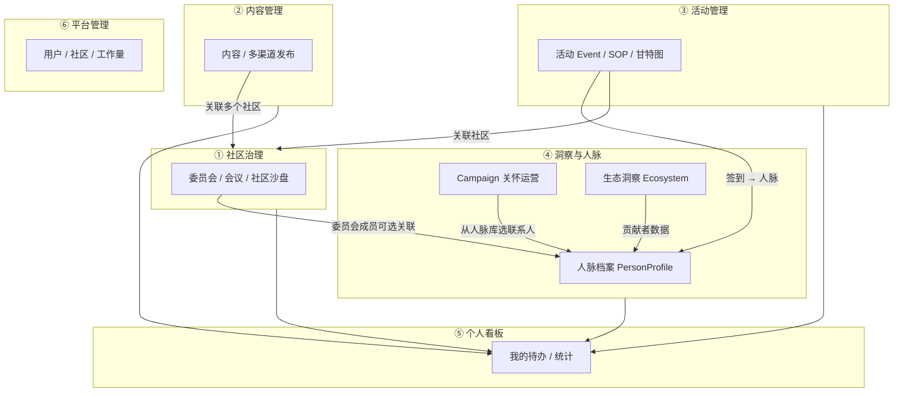
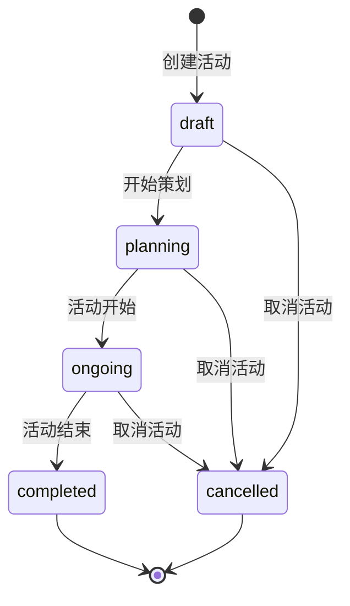
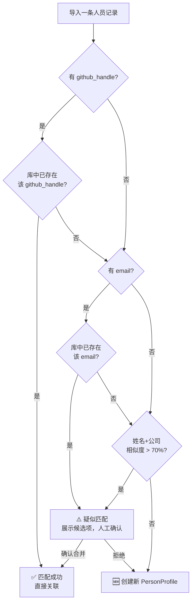
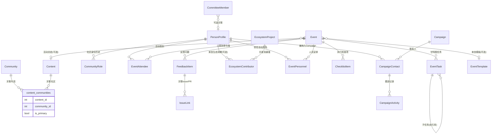
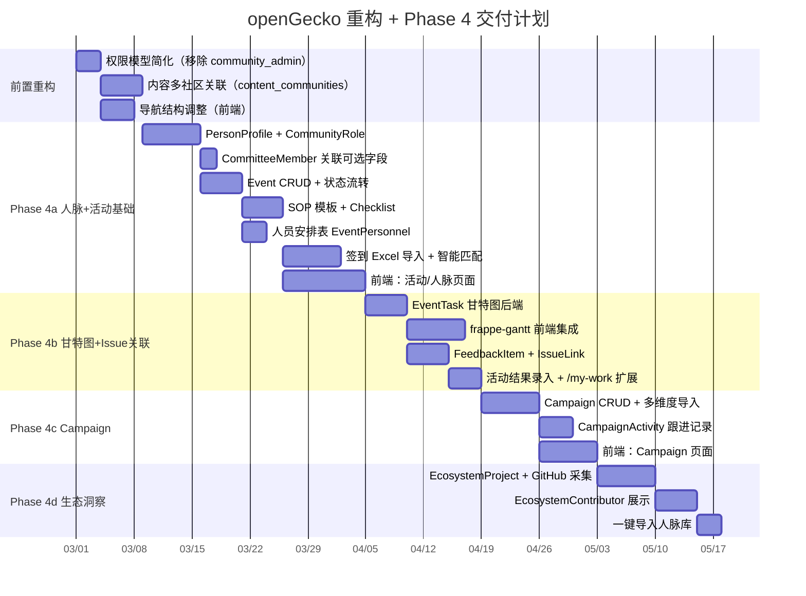

# openGecko — 平台重构与新模块产品需求文档（PRD）

**产品名称**: openGecko — 多社区运营管理平台
**文档版本**: v2.0
**更新日期**: 2026-02-22
**文档状态**: 规划中（待评审）
**关联文档**: [01-需求分析文档.md](./01-需求分析文档.md)（已交付功能基线）

---

## 目录

1. [重构动机与目标](#1-重构动机与目标)
2. [六大模块总览](#2-六大模块总览)
3. [权限模型设计](#3-权限模型设计)
4. [模块详细设计](#4-模块详细设计)
   - 4.1 [社区治理模块](#41-社区治理模块)
   - 4.2 [内容管理模块](#42-内容管理模块)
   - 4.3 [活动管理模块](#43-活动管理模块)
   - 4.4 [社区洞察与人脉管理模块（含生态洞察与 Campaign）](#44-社区洞察与人脉管理模块)
   - 4.5 [平台管理模块](#45-平台管理模块)
   - 4.6 [个人工作看板](#46-个人工作看板)
5. [导航结构](#5-导航结构)
6. [数据模型总览](#6-数据模型总览)
7. [技术架构设计](#7-技术架构设计)
8. [分阶段交付计划](#8-分阶段交付计划)
9. [风险与约束](#9-风险与约束)

---

## 1. 重构动机与目标

### 1.1 现有架构的问题

openGecko 已具备内容生产、多渠道发布和社区治理的基础能力，但随着业务深入，当前架构存在以下主要问题：

| 问题 | 具体表现 |
|------|---------|
| **模块边界不清晰** | 内容、社区、人员三者高度耦合，内容必须从属于某一固定社区，无法跨社区复用 |
| **权限层级冗余** | 四层权限（superuser / admin / community_admin / user）导致权限判断复杂，社区管理员概念引发业务歧义 |
| **活动运营无工具支撑** | 线上/线下活动策划散落在多维表格，关怀类 Campaign 无系统化跟进工具 |
| **关键人员数据孤岛** | 委员会成员、活动参与者、生态贡献者三份数据互不关联 |
| **缺乏生态视野** | 只能看到自己社区的数据，无法感知外部主流开源社区的技术动向 |

### 1.2 重构目标

1. **确立六大业务模块**，各模块职责单一、边界清晰
2. **简化权限模型**为三层，去除社区管理员角色
3. **内容独立化**：内容脱离单一社区归属，改为多社区关联
4. **补齐活动与人脉两大运营工具**
5. **为平台级洞察能力奠定基础**


---

## 2. 六大模块总览

### 2.1 模块划分

| # | 模块名称 | 定位 | 多租户策略 |
|---|---------|------|-----------|
| 1 | **社区治理** | 围绕某一具体社区展开，管理委员会、会议和治理沙盘 | 社区隔离（必须选定社区才能查看）|
| 2 | **内容管理** | 平台级独立模块，管理所有内容，通过关联关系绑定到一个或多个社区 | 内容本身平台级，关联表按社区隔离 |
| 3 | **活动管理** | 平台级独立模块，管理所有类型活动（线上/线下/混合），通过属性与社区关联 | 活动本身可跨社区，主社区隔离 |
| 4 | **社区洞察与人脉管理** | 对主流社区人员和技术方向的洞察，以人为中心开展工作；Campaign 作为人脉运营的子功能 | PersonProfile 平台级共享，Campaign 按社区隔离 |
| 5 | **个人工作看板** | 每个用户的个人工作台，汇聚所有分配给自己的待办任务 | 按登录用户隔离 |
| 6 | **平台管理** | 平台本身的管理：人员管理、工作量管理、社区整体管理 | 仅管理员及以上可见 |

### 2.2 模块关系总览



### 2.3 现有能力对应关系

| 现有功能 | 重构后归属 | 变化说明 |
|---------|-----------|---------|
| 社区工作台（沙盘）| 社区治理模块 | 无变化，选定社区后查看 |
| 内容管理 + 发布管理 | 内容管理模块 | **内容改为多社区关联**，脱离单一 community_id 直接归属 |
| 委员会 + 会议管理 | 社区治理模块 | 无变化 |
| 个人工作台 `/my-work` | 个人工作看板 | 扩展：新增活动检查项和 Campaign 跟进 |
| 超管区域（社区总览等）| 平台管理模块 | 无变化，权限模型简化 |

---

## 3. 权限模型设计

### 3.1 三层权限体系

去除原有的「社区管理员（community_admin）」角色，简化为三层：

| 角色 | 标识 | 说明 |
|------|------|------|
| **超级管理员** | `superuser` | 平台拥有者，拥有全量权限，且唯一可以设置/撤销管理员角色 |
| **管理员** | `admin` | 辅助超级管理员，权限与超级管理员基本一致，唯一差异是不能变更用户角色 |
| **普通用户** | `user` | 业务操作人员，可访问所有业务模块，不能看到平台管理模块（⑥号模块）|

### 3.2 权限矩阵

| 能力 | 普通用户 | 管理员 | 超级管理员 |
|------|---------|--------|-----------|
| 查看社区治理（委员会/会议/沙盘）| ✅ | ✅ | ✅ |
| 编辑委员会 / 会议 | ✅ | ✅ | ✅ |
| 创建/编辑内容 | ✅ | ✅ | ✅ |
| 发布内容到渠道 | ✅ | ✅ | ✅ |
| 创建/管理活动 | ✅ | ✅ | ✅ |
| 创建/管理 Campaign | ✅ | ✅ | ✅ |
| 管理人脉档案（增删改导入导出）| ✅ | ✅ | ✅ |
| 查看生态洞察 | ❌ | ✅ | ✅ |
| 配置生态监控（EcosystemProject）| ❌ | ✅ | ✅ |
| **进入平台管理模块** | ❌ | ✅ | ✅ |
| 管理平台用户（增删停用）| ❌ | ✅ | ✅ |
| 管理社区（增删配置）| ❌ | ✅ | ✅ |
| 查看工作量统计 | ❌ | ✅ | ✅ |
| **设置/撤销管理员角色** | ❌ | ❌ | ✅ |

### 3.3 代码层影响

原有 `community_users` 表中的 `community_admin` 角色值需要迁移处理：

```python
# 迁移策略：两步执行
# 第一步：所有 community_admin 一律降级为 user（自动运行）
# Alembic migration: 002_simplify_roles.py
# UPDATE community_users SET role = 'user' WHERE role = 'community_admin';
# 第二步：人工确认，将应升级为 admin 的账号喵名单邀挋发至管理员手动执行
```

FastAPI 依赖函数调整：
- 移除 `get_community_admin` 依赖
- `get_current_active_superuser` → 保留（仅超级管理员）
- 新增 `get_current_admin_or_superuser` → 管理员及以上
- `get_current_user` → 所有已登录用户

---

## 4. 模块详细设计

### 4.1 社区治理模块

#### 4.1.1 现有功能保持不变

社区治理模块保留所有已交付功能，无破坏性修改：

- **社区沙盘**：选定社区后查看整体运营数据概览
- **委员会管理**：委员会 CRUD，成员任期管理
- **会议管理**：会议创建、纪要记录、ICS 导出

#### 4.1.2 新增：CommitteeMember 与 PersonProfile 关联

CommitteeMember 新增可选的 `person_id` 字段，管理员可将委员会成员与人脉档案关联：

```python
# CommitteeMember 模型新增字段（不破坏现有逻辑）
person_id: Mapped[int | None] = mapped_column(ForeignKey("person_profiles.id"), nullable=True)
```

**关联后效果**：
- 委员会成员详情页可展示其完整人脉档案（活动参与历史、社区身份）
- 人脉档案页展示该人在本社区委员会的任职记录
- 关联不强制，不影响未关联的委员会成员的任何现有逻辑

#### 4.1.3 页面结构（现有，无变化）

```
/communities/:id/governance    社区治理沙盘
/committees                    委员会列表
/committees/:id                委员会详情 + 成员
/meetings                      会议列表
/meetings/:id                  会议详情 + 纪要
```

---

### 4.2 内容管理模块

#### 4.2.1 核心变化：内容多社区关联

**当前设计**：`contents.community_id` 直接外键，内容必须归属一个社区。

**重构后设计**：内容本身是平台级资产，通过 `content_communities` 关联表与多个社区绑定。

```
contents（平台级）
    ↕  content_communities（关联表）
communities（多个）
```

**`content_communities` 关联表**：

| 字段 | 类型 | 说明 |
|------|------|------|
| content_id | int | FK → contents |
| community_id | int | FK → communities |
| is_primary | bool | 是否为主社区（内容创建时默认选择的社区）|
| linked_at | datetime | 关联时间 |
| linked_by_id | int | 操作人 |

**迁移策略**：
- 现有 `contents.community_id` 数据迁移到 `content_communities`，`is_primary = True`
- `contents.community_id` 字段在迁移完成后移除（需两步迁移，中间版本兼容过渡）

#### 4.2.2 影响范围

| 受影响模块 | 调整内容 |
|----------|---------|
| `app/models/content.py` | 移除 `community_id` 字段，新增 `communities` 关系 |
| `app/api/contents.py` | 创建/更新内容时支持关联多个 community_id |
| `app/schemas/content.py` | `community_id` → `community_ids: list[int]` |
| `app/api/dashboard.py` | 社区沙盘统计改用 `content_communities` 查询 |
| 前端内容创建表单 | 社区选择从单选改为多选 |

#### 4.2.3 页面结构（现有结构不变，调整关联逻辑）

```
/contents              内容列表（可按关联社区筛选）
/contents/new          创建内容（社区关联改为多选）
/contents/:id          内容详情 + 编辑 + 关联社区管理
/contents/calendar     内容日历
/publish/channels      发布渠道配置
/publish/wechat-stats  微信阅读统计
```

---

### 4.3 活动管理模块

#### 4.3.1 模块定位

活动管理是平台级独立模块，主要社区通过 `community_id` 字段标识归属，同时支持：
- **线上活动**：直播、Webinar、线上沙龙
- **线下活动**：技术沙龙、峰会、黑客松
- **混合活动**：线上线下同步举办

> **Campaign 不在本模块**：Campaign（关怀/推广/邀约/调研运营）是以人脉库为基础的运营动作，归属「社区洞察与人脉管理模块」（§4.4.7），本模块仅管理事件性活动（Event）。

#### 4.3.2 SOP 模板管理

运营人员可以为不同类型的活动（线上直播、线下沙龙、黑客松等）创建标准化执行模板，模板包含三阶段的检查项清单。

**SOP 模板（EventTemplate）数据结构**：

| 字段 | 类型 | 说明 |
|------|------|------|
| id | int | 主键 |
| community_id | int | 所属社区 |
| name | string | 模板名称（如“线下技术沙龙 SOP”）|
| event_type | enum | online / offline / hybrid |
| description | text | 模板适用场景说明 |
| is_public | bool | 是否对同平台所有社区可见（默认仅本社区） |

**模板检查项（ChecklistTemplateItem）**：

| 字段 | 类型 | 说明 |
|------|------|------|
| id | int | 主键 |
| template_id | int | FK → EventTemplate |
| phase | enum | pre（活动前）/ during（活动中）/ post（活动后）|
| title | string | 检查项标题 |
| description | text | 执行说明（可选）|
| order | int | 同阶段内排序 |

**用户故事**：
```
作为社区管理员，
我想创建一套线下活动 SOP 模板，
以便每次组织活动时不需要从零开始设计检查清单。

验收标准：
- 可创建多个模板，不同活动类型使用不同模板
- 模板检查项支持三阶段划分（活动前/中/后）
- 创建活动时可选择已有模板，自动实例化检查项
- 模板更新不影响已创建的活动（快照独立）
```

#### 4.3.3 活动实例管理

**活动（Event）数据结构**：

| 字段 | 类型 | 说明 |
|------|------|------|
| community_id | int | 所属社区 |
| title | string | 活动名称 |
| event_type | enum | online / offline / hybrid |
| template_id | int? | 使用的 SOP 模板（可选）|
| status | enum | draft / planning / ongoing / completed / cancelled |
| planned_at | datetime | 计划举办时间 |
| duration_minutes | int | 预计时长（分钟）|
| location | string? | 线下地点 |
| online_url | string? | 线上直播/会议链接 |
| description | text? | 活动简介 |
| cover_image_url | string? | 封面图 |
| owner_id | int | 负责人（系统用户）|
| attendee_count | int? | 实际参与总人数（活动结束后填写）|
| online_count | int? | 线上参与人数 |
| offline_count | int? | 线下参与人数 |
| registration_count | int? | 报名人数 |
| result_summary | text? | 活动总结（富文本，活动结束后填写）|
| media_urls | list[string] | 活动照片/录制视频链接（JSON 存储）|

> **设计说明**：活动结果字段直接内嵌在 Event 表中（而非独立的 EventResult 表），因为活动与结果是严格的 1:1 关系，独立建表只会增加 JOIN 复杂度而无任何收益。

**活动状态流转**：



#### 4.3.4 Checklist 执行追踪

活动创建后，从模板实例化 ChecklistItem，运营人员在活动执行过程中逐项打勾。

**ChecklistItem 数据结构**：

| 字段 | 类型 | 说明 |
|------|------|------|
| event_id | int | 所属活动 |
| phase | enum | pre / during / post |
| title | string | 检查项标题（可在实例中修改）|
| status | enum | pending / done / skipped |
| assignee_id | int? | 负责人（系统用户）|
| due_date | date? | 截止日期 |
| notes | text? | 执行备注 |
| order | int | 排序 |

**用户故事**：
```
作为活动执行人员，
我想按阶段查看和勾选活动检查项，
以便确保每个关键步骤都被执行到位。

验收标准：
- 检查项按 pre / during / post 三阶段分组展示
- 每项可单独标记完成/跳过，并填写备注
- 活动详情页顶部显示各阶段完成进度（如"活动前 8/10"）
- 支持在活动实例中临时增删检查项（不影响原模板）
```

#### 4.3.5 甘特图（项目时间线）

甘特图与 Checklist 并存，用于可视化活动的项目时间规划，支持任务依赖关系。

**EventTask 数据结构**：

| 字段 | 类型 | 说明 |
|------|------|------|
| event_id | int | 所属活动 |
| title | string | 任务名称 |
| task_type | enum | task / milestone |
| phase | enum | pre / during / post |
| start_date | date | 开始日期 |
| end_date | date | 结束日期 |
| progress | int | 进度 0-100% |
| status | enum | not_started / in_progress / completed / blocked |
| depends_on | list[int] | 前置任务 ID 列表（JSON 存储，无数据库级外键）|
| parent_task_id | int? | 父任务（支持子任务层级）|
| order | int | 同级排序 |

**EventTaskAssignee 数据结构**：

| 字段 | 类型 | 说明 |
|------|------|------|
| task_id | int | 所属任务 |
| assignee_type | enum | internal / external |
| user_id | int? | 系统内部用户 |
| person_id | int? | 人脉中台的外部人员（如嘉宾）|

**用户故事**：
```
作为活动负责人，
我想通过甘特图规划活动的时间线和任务依赖，
以便团队成员清楚各自的工作节点。

验收标准：
- 甘特图展示活动所有任务的时间条
- 支持拖拽调整任务开始/结束日期
- 任务间可设置前置依赖，以箭头连线展示
- 里程碑以菱形标记区分
- 支持任务折叠/展开（父子任务）
- 任务可分配给系统用户或外部人脉档案
```

**前端技术选型**：引入 `frappe-gantt`（MIT 协议，轻量）或 `vue-ganttastic`，避免使用 ECharts 自绘（交互体验差）。

#### 4.3.6 人员安排

活动中每个角色的分工表，区别于甘特图任务的执行负责人，专注于活动当天的角色分配。

**EventPersonnel 数据结构**：

| 字段 | 类型 | 说明 |
|------|------|------|
| event_id | int | 所属活动 |
| role | enum | host / speaker / moderator / coordinator / photographer / volunteer / sponsor_rep / other |
| role_label | string? | 自定义角色名（role=other 时必填）|
| assignee_type | enum | internal / external |
| user_id | int? | 系统内部用户 |
| person_id | int? | 人脉中台外部人员 |
| confirmed | enum | pending（待确认）/ confirmed（已确认）/ declined（已拒绝）|
| time_slot | string? | 负责时段（如 "14:00-15:00"）|
| notes | text? | 备注（上台顺序、特殊要求等）|
| order | int | 排序 |

**用户故事**：
```
作为活动负责人，
我想明确列出活动中每个人员的角色和时段安排，
以便活动当天各司其职、执行顺畅。

验收标准：
- 支持添加系统内用户或外部人脉档案为活动人员
- 每个人员可指定角色、时段和确认状态
- 人员安排列表可导出为 PDF 或分享给相关人员
- 人员确认状态可批量发送邮件提醒（依赖 SMTP 配置）
```

#### 4.3.7 活动结果记录

活动结束后录入执行结果，支持导入签到名单并自动与人脉中台关联。

> **数据模型说明**：活动结果字段已直接内嵌于 Event 表（`attendee_count`、`online_count`、`offline_count`、`registration_count`、`result_summary`、`media_urls`），无需独立的 EventResult 表，详见 §4.3.3 Event 数据结构。

**签到名单导入**：
- 支持 Excel/CSV 上传
- 系统提供标准导入模板（必填：姓名、邮箱；推荐：GitHub账号、公司、职位）
- 导入后与 PersonProfile 进行智能匹配（github_handle 优先，其次邮箱，最后姓名+公司）
- 未匹配到的自动创建新 PersonProfile
- 存疑的匹配项（相似度 > 70% 但非完全匹配）展示给运营人员人工确认

#### 4.3.8 反馈问题与 Issue 关联

活动中收集的问题/反馈可录入系统并与 GitHub/GitCode Issue 关联，跟踪闭环进度。

**FeedbackItem 数据结构**：

| 字段 | 类型 | 说明 |
|------|------|------|
| event_id | int | 所属活动 |
| content | text | 反馈/问题内容 |
| category | enum | question / suggestion / bug_report / appreciation / other |
| raised_by | string? | 提问人姓名（不强制关联 PersonProfile）|
| raised_by_person_id | int? | 可选关联 PersonProfile（签到导入后可自动匹配）|
| status | enum | open / in_progress / closed |
| assignee_id | int? | 负责跟进的系统用户 |

**IssueLink 数据结构（预留深度集成能力）**：

| 字段 | 类型 | 说明 |
|------|------|------|
| feedback_id | int | 所属反馈项 |
| platform | enum | github / gitcode / gitee |
| repo | string | 仓库路径（如 "org/repo"）|
| issue_number | int | Issue 编号 |
| issue_url | string | Issue 完整 URL |
| issue_type | enum | issue / pr |
| issue_status | enum | open / closed（定时同步）|
| linked_at | datetime | 关联时间 |
| linked_by_id | int | 操作用户 |

> **深度集成预留**：IssueLink 表结构已预留 `platform`、`repo`、`issue_number` 字段，未来可接入 GitHub OAuth App 实现在 openGecko 内直接创建/评论/关闭 Issue，无需修改现有数据结构。

**用户故事**：
```
作为社区运营人员，
我想将活动中收集的问题关联到对应的 GitHub Issue，
以便追踪问题是否得到技术团队的处理和回复。

验收标准：
- 可手动录入 Issue URL 完成关联
- 系统每日自动同步 Issue 的 open/closed 状态
- 反馈列表展示关联 Issue 数量和已关闭比例
- 支持按状态（open/closed）筛选反馈问题
```

#### 4.3.9 活动模块页面结构

```
/events              活动列表（支持按类型/状态/时间筛选）
/events/new          创建活动（选择模板）
/events/:id          活动详情（Tab 切换）
  ├── Tab: 基本信息
  ├── Tab: 甘特图
  ├── Tab: 人员安排
  ├── Tab: Checklist
  └── Tab: 活动结果（含签到导入、反馈问题）
/event-templates     SOP 模板管理
```

> Campaign 相关路由归属「社区洞察与人脉管理模块」（§4.4.6）。

---

### 4.4 社区洞察与人脉管理模块

#### 4.4.1 模块定位

本模块以**人**为核心，覆盖两个方向：
- **人脉管理**：维护和管理值得关注的人员档案，统一沉淀来自活动签到、手动录入、生态洞察各渠道的人员数据
- **Campaign**：以人脉库为基础，对关键人物开展系统化的推广/关怀/邀约/调研运营

生态洞察作为本模块的数据来源之一，提供对外部主流开源社区的人员和技术方向感知能力。

#### 4.4.2 PersonProfile 人脉档案

**与 CommitteeMember 的关系**：

PersonProfile 不替换委员会成员（CommitteeMember），而是与之互补：

| 维度 | CommitteeMember | PersonProfile |
|------|----------------|---------------|
| **定位** | 本社区委员会的治理角色 | 所有值得关注的人（内外部）|
| **关联** | 与委员会绑定，有任期概念 | 独立存在，跨社区、跨场景 |
| **数据来源** | 运营人员手动录入 | 活动导入 / 生态洞察同步 / 手动添加 |
| **关联方式** | CommitteeMember 可选关联一个 PersonProfile | PersonProfile 上聚合参与度数据 |

**关联策略**：CommitteeMember 新增可选的 `person_id` 字段，管理员可手动将委员会成员与人脉档案关联，但不强制。

**PersonProfile 数据结构**：

| 字段 | 类型 | 约束 | 说明 |
|------|------|------|------|
| id | int | PK, 自增 | **唯一主键**，始终存在 |
| display_name | string | NOT NULL | 显示名（人工可读，允许重名）|
| avatar_url | string? | — | 头像 URL |
| github_handle | string? | 唯一索引（允许 NULL）| GitHub 账号，存在时全局唯一 |
| gitcode_handle | string? | 唯一索引（允许 NULL）| GitCode 账号，存在时全局唯一 |
| email | string? | 唯一索引（允许 NULL）| 邮箱，存在时全局唯一 |
| phone | string? | — | 手机号（仅内部可见）|
| company | string? | — | 所在公司/组织 |
| location | string? | — | 地区 |
| bio | text? | — | 简介 |
| tags | list[string] | — | 自定义标签（如"KOL"、"布道师"）|
| notes | text? | — | 运营备注（富文本，仅内部可见）|
| source | enum | NOT NULL | manual / event_import / ecosystem_import |
| created_by_id | int? | FK → User | 创建人（系统导入时为 NULL）|
| created_at | datetime | NOT NULL | 创建时间 |
| updated_at | datetime | NOT NULL | 最后更新时间 |

> **主键设计说明**：`id`（自增整数）是唯一的物理主键。`github_handle`、`gitcode_handle`、`email` 三个字段各自建立**稀疏唯一索引**（Partial Unique Index，仅在非 NULL 时生效），用于去重匹配，但均非必填。一个没有任何平台账号的人也可以作为有效的 PersonProfile 存在（以 `display_name` 区分）。

**计算字段（非存储，实时聚合）**：
- `events_attended`：参与活动次数（来自 EventAttendee 表）
- `last_event_at`：最近一次活动时间
- `active_community_roles`：当前在任的社区身份数量
- `campaign_count`：被纳入的 Campaign 数量

> **性能说明**：上述计算字段在 MVP 阶段采用实时 COUNT 聚合。当 PersonProfile 记录超过万级时，应改为差异更新缓存（在 Event/Campaign 内容发生变化时更新对应的 PersonProfile 计数器）。

#### 4.4.3 身份去重匹配策略

导入签到名单或从生态洞察同步时，按以下优先级判断是否为同一人：



**匹配规则说明**：
- `github_handle` 精确匹配 → 自动关联，无需人工确认（开源社区账号全球唯一）
- `email` 精确匹配 → 标记为疑似，人工确认（同一邮箱可能被多人使用企业邮箱）
- 姓名+公司模糊匹配 → 标记为疑似，人工确认
- 无任何匹配 → 自动创建新档案

**SQLite/PostgreSQL 稀疏唯一索引实现**：
```sql
-- PostgreSQL: 原生支持 Partial Index
CREATE UNIQUE INDEX ix_person_github ON person_profiles(github_handle)
    WHERE github_handle IS NOT NULL;

-- SQLite: 通过 CHECK 约束 + 应用层逻辑实现等效效果
--（Alembic 迁移中使用 UniqueConstraint + 应用层 None 检查）
```

#### 4.4.4 CommunityRole 社区身份历史

记录人物在各开源社区中担任的角色，支持历史追踪。

| 字段 | 类型 | 说明 |
|------|------|------|
| person_id | int | 所属档案 |
| community_name | string | 社区名称（如 "OpenHarmony"）|
| project_url | string? | 项目链接（GitHub/Gitee 主页）|
| role | string | 角色（contributor / committer / maintainer / tsc_member / founder / board_member / other）|
| role_label | string? | 角色自定义名称 |
| is_current | bool | 是否当前在任 |
| started_at | date? | 开始时间 |
| ended_at | date? | 结束时间（NULL 表示至今）|
| source_url | string? | 佐证链接（如贡献者名单页）|
| updated_by_id | int? | 最后更新人 |

**用户故事**：
```
作为社区运营人员，
我想查看某位关键人物在各开源社区的历史角色变迁，
以便判断其影响力范围和合作价值。

验收标准：
- 人脉档案页展示该人物的社区身份时间线
- 时间线按时间倒序排列，当前在任角色置顶
- 支持手动添加/编辑角色记录
- 当生态洞察模块检测到角色变化时，以提醒形式通知运营人员确认
```

#### 4.4.5 EventAttendee 签到关联表

| 字段 | 类型 | 说明 |
|------|------|------|
| event_id | int | 活动 ID |
| person_id | int | 人脉档案 ID |
| checked_in | bool | 是否实际签到（区别于仅报名）|
| role_at_event | string? | 本次活动中的角色（"嘉宾"/"观众"/"志愿者"）|
| source | enum | manual（手动录入）/ excel_import（Excel 导入）|

#### 4.4.6 人脉模块页面结构

```
/people              人脉列表（支持按标签/社区角色/活动参与度筛选）
/people/import       批量导入（Excel/CSV）
/people/:id          人脉详情
  ├── 基本信息 + 联系方式
  ├── 社区身份时间线
  ├── 参与活动记录
  └── Campaign 参与记录
/campaigns           Campaign 列表
/campaigns/new       创建 Campaign
/campaigns/:id       Campaign 详情
```

#### 4.4.7 Campaign（人脉运营）

Campaign 是以人脉库为基础的运营动作管理工具，支持推广/关怀/邀约/调研四类。

**Campaign 数据结构**：

| 字段 | 类型 | 说明 |
|------|------|------|
| id | int | 主键 |
| community_id | int | 所属社区 |
| name | string | Campaign 名称（如"2026 开发者峰会嘉宾邀约"）|
| description | text? | Campaign 背景和目标 |
| type | enum | promotion（推广）/ care（关怀）/ invitation（邀约）/ survey（调研）|
| status | enum | draft / active / completed / archived |
| target_count | int? | 目标触达人数 |
| owner_id | int | Campaign 负责人 |
| start_date | date? | 开始日期 |
| end_date | date? | 目标完成日期 |
| created_at | datetime | 创建时间 |

**联系人导入（多维度）**：

Campaign 创建后，从以下来源导入联系人：

| 来源 | 导入操作 | 说明 |
|------|---------|------|
| **活动参与者** | 选择一场或多场活动 | 导入其签到人员 |
| **生态关键角色** | 按社区/角色类型筛选 | 来自生态洞察模块 |
| **人脉库搜索** | 按标签/公司/角色筛选 | 来自 PersonProfile |
| **手动添加** | 搜索或新建 PersonProfile | 直接操作 |
| **Excel/CSV 导入** | 字段映射后批量导入 | 匹配或创建 PersonProfile |

**CampaignContact 联系人状态**：

| 字段 | 类型 | 说明 |
|------|------|------|
| campaign_id | int | 所属 Campaign |
| person_id | int | 联系人 |
| status | enum | pending / contacted / responded / converted / declined |
| channel | enum | email / wechat / phone / in_person / other |
| added_by | enum | manual / event_import / ecosystem_import / csv_import |
| last_contacted_at | datetime? | 最后联系时间 |
| notes | text? | 当前状态备注 |
| assigned_to_id | int? | 本联系人的跟进负责人（可不同于 Campaign 负责人）|

**CampaignActivity 跟进记录**：

| 字段 | 类型 | 说明 |
|------|------|------|
| campaign_id | int | 所属 Campaign |
| person_id | int | 联系对象 |
| action | enum | sent_email / made_call / sent_wechat / in_person_meeting / got_reply / note |
| content | text? | 跟进内容摘要 |
| outcome | string? | 跟进结果（如"已接受邀请"）|
| operator_id | int | 操作人 |
| created_at | datetime | 记录时间 |

**用户故事**：
```
作为社区运营人员，
我想在 Campaign 中查看每位联系人的完整跟进历史，
以便避免重复联系并了解当前进展。

验收标准：
- 每位联系人的跟进记录按时间倒序展示
- 添加跟进记录后联系人状态自动可更新
- Campaign 概览页展示各状态联系人数量（漏斗图）
- 多人协作同一 Campaign 时，操作记录显示操作人姓名
```

#### 4.4.8 生态洞察（管理员及以上可见）

##### 4.4.8.1 监控社区管理

MVP 阶段聚焦于数据采集和展示，不做 AI 分析，保持架构预留能力。

**EcosystemProject（监控社区）数据结构**：

| 字段 | 类型 | 说明 |
|------|------|------|
| id | int | 主键 |
| name | string | 社区名称 |
| platform | enum | github / gitee / gitcode |
| org_name | string | 组织名（如 "kubernetes"）|
| repo_name | string? | 主仓库名（可选，填写后监控单仓库）|
| description | text? | 社区简介 |
| tags | list[string] | 技术标签（如 "云原生"、"AI"）|
| is_active | bool | 是否启用监控 |
| last_synced_at | datetime? | 最近一次数据同步时间 |
| added_by_id | int | 添加人（管理员及以上）|

##### 4.4.8.2 关键角色追踪

**EcosystemContributor（关键贡献者）数据结构**：

| 字段 | 类型 | 说明 |
|------|------|------|
| project_id | int | 所属监控社区 |
| github_handle | string | GitHub 账号 |
| display_name | string | 显示名 |
| avatar_url | string? | 头像 |
| role | string | 从 GitHub 推断：owner / member / contributor |
| commit_count_90d | int? | 近 90 天提交数 |
| pr_count_90d | int? | 近 90 天 PR 数 |
| star_count | int? | 个人 star 数 |
| followers | int? | 粉丝数 |
| person_id | int? | 关联到人脉中台的 PersonProfile（可选，手动确认）|
| last_synced_at | datetime | 数据同步时间 |

##### 4.4.8.3 数据同步机制

- **触发方式**：管理员及以上手动触发 或 后台定时任务（每日凌晨）
- **数据来源**：GitHub REST API / Gitee API（使用 Personal Access Token）
- **采集内容**：仓库基本信息（star/fork/watch 趋势）、贡献者列表（近 90 天 commits）、最近发布的 Release
- **API 限流处理**：GitHub API 未认证限制 60 次/小时，PAT 可达 5000 次/小时，配置 Token 后才能启用自动同步

##### 4.4.8.4 关键角色导入人脉库

当生态洞察发现某位贡献者值得关注时，运营人员可一键将其导入人脉中台：
- 检查 `github_handle` 是否已存在于 PersonProfile
- 存在则展示现有档案并提示是否更新数据
- 不存在则创建新 PersonProfile，`source = ecosystem_import`

##### 4.4.8.5 页面结构

```
/ecosystem           监控社区列表 + 数据概览
/ecosystem/:id       社区详情
  ├── 基本指标（Star/Fork/Contributor 趋势图）
  ├── 关键贡献者排行（按近 90 天活跃度）
  └── 最近 Release 记录
```

---

### 4.5 平台管理模块

平台管理模块是管理员（admin）及超级管理员（superuser）专属区域，普通用户不可见。

| 功能项 | 说明 |
|-------|------|
| **用户管理** | 创建/停用平台账号，查看所有用户列表 |
| **角色管理** | 设置/撤销管理员角色（仅超级管理员可操作）|
| **社区管理** | 创建/编辑/停用社区，查看社区整体数据 |
| **工作量统计** | 按用户/社区/时间维度查看内容、活动、Campaign 的工作量 |

> 本模块功能已在现有超管区域实现，重构后仅调整导航归属，业务逻辑无变化。

---

### 4.6 个人工作看板

个人工作看板（`/my-work`）汇聚当前登录用户所有待完成的任务，无需跨多个模块查找。

**现有汇聚内容**：
- 分配给我的内容（草稿/审核中）
- 我参与的会议（即将召开）

**新增汇聚内容**：
- **活动检查项**：分配给我的 pending ChecklistItem（按活动分组展示）
- **Campaign 跟进**：分配给我的 pending CampaignContact（按 Campaign 分组展示）

**统计卡片新增**：
- 本月我负责的活动数量
- 我跟进中的 Campaign 联系人数

---

## 5. 导航结构

### 5.1 新导航结构

以下为六大模块对应的导航菜单设计（括号内为可见角色）：

```
┌─ 个人工作看板（全部用户）
│    └── /my-work  — 我的待办 / 统计概览
│
├─ 社区治理（全部用户 · 需先选择社区）
│    └── /communities/:id/governance  — 治理沙盘
│    └── /committees                  — 委员会
│    └── /meetings                    — 会议
│
├─ 内容管理（全部用户）
│    ├── /contents                    — 内容列表
│    ├── /contents/calendar           — 内容日历
│    └── /publish/channels            — 发布渠道
│
├─ 活动管理（全部用户）
│    ├── /events                      — 活动列表
│    └── /event-templates             — SOP 模板
│
├─ 洞察与人脉（全部用户）
│    ├── /people                      — 人脉库
│    ├── /campaigns                   — Campaign
│    └── /ecosystem                   — 生态洞察（仅管理员+）
│
└─ 平台管理（仅管理员+）
     ├── 用户管理
     ├── 社区管理
     └── 工作量统计
```

### 5.2 权限与可见性规则

| 菜单项 | 普通用户 | 管理员 | 超级管理员 |
|-------|---------|--------|-----------|
| 个人工作看板 | ✅ | ✅ | ✅ |
| 社区治理 | ✅ | ✅ | ✅ |
| 内容管理 | ✅ | ✅ | ✅ |
| 活动管理 | ✅ | ✅ | ✅ |
| 洞察与人脉（人脉库 + Campaign）| ✅ | ✅ | ✅ |
| 洞察与人脉（生态洞察）| ❌ | ✅ | ✅ |
| 平台管理 | ❌ | ✅ | ✅ |

---

## 6. 数据模型总览



---

## 7. 技术架构设计

### 7.1 后端新增模块目录

```
backend/app/
├── api/
│   ├── events.py           # 活动管理 API
│   ├── event_templates.py  # SOP 模板 API
│   ├── people.py           # 人脉档案 API
│   ├── campaigns.py        # Campaign API
│   └── ecosystem.py        # 生态洞察 API
├── models/
│   ├── event.py            # Event, EventTemplate, EventTask,
│   │                       # EventPersonnel, EventAttendee,
│   │                       # ChecklistItem, FeedbackItem, IssueLink
│   ├── people.py           # PersonProfile, CommunityRole
│   ├── campaign.py         # Campaign, CampaignContact, CampaignActivity
│   └── ecosystem.py        # EcosystemProject, EcosystemContributor
├── schemas/
│   ├── event.py
│   ├── people.py
│   ├── campaign.py
│   └── ecosystem.py
└── services/
    ├── event_service.py    # 签到导入 + 人员匹配逻辑
    ├── people_service.py   # PersonProfile 去重合并
    ├── campaign_service.py
    └── ecosystem/
        ├── github_crawler.py   # GitHub REST API 采集
        └── scheduler.py        # APScheduler 定时任务
```

### 7.2 关键技术决策

| 决策点 | 选型 | 理由 |
|--------|------|------|
| 甘特图前端库 | `frappe-gantt` | MIT 协议，轻量（< 50KB），支持拖拽和依赖箭头 |
| 定时任务 | APScheduler（内置 FastAPI 进程）| 无需 Celery，适合当前体量 |
| Excel 导入 | `openpyxl` | 已有依赖，无需新增 |
| 生态数据采集 | `httpx`（异步）| 项目已有，直接调用 GitHub REST API |
| 人员去重 | Levenshtein 距离（应用层）| 不引入 ES 等重量级工具 |
| 内容多社区关联 | `content_communities` 关联表 | 原 community_id 外键废弃，数据迁移两步进行 |

### 7.3 数据库迁移规划

| 迁移文件 | 内容 |
|---------|------|
| `002_simplify_roles.py` | 移除 `community_users.role = community_admin`，统一为 user |
| `003_add_content_communities.py` | 新增关联表，迁移现有 `contents.community_id` 数据 |
| `004_add_people_module.py` | PersonProfile, CommunityRole, EventAttendee |
| `005_add_event_module.py` | Event, EventTemplate, EventTask, EventPersonnel, ChecklistItem, FeedbackItem, IssueLink |
| `006_add_campaign_module.py` | Campaign, CampaignContact, CampaignActivity |
| `007_add_ecosystem_module.py` | EcosystemProject, EcosystemContributor |
| `008_link_committee_member_to_person.py` | CommitteeMember 新增可选 person_id 外键 |
| `009_remove_content_community_id.py` | 迁移完成后移除 contents.community_id 列 |

---

## 8. 分阶段交付计划



### 前置重构阶段

**目标**：完成权限模型简化和内容多社区关联的数据层重构，为后续新功能奠定基础。

**交付内容**：
- [ ] Alembic 迁移：移除 `community_admin` 角色，更新 FastAPI 依赖函数
- [ ] `content_communities` 关联表 + 数据迁移脚本
- [ ] 后端 API 调整：内容创建/编辑支持 `community_ids: list[int]`
- [ ] 前端：内容社区选择从单选改为多选，导航菜单重组

### Phase 4a：人脉中台 + 活动管理基础

**交付内容**：
- [ ] PersonProfile CRUD + CommunityRole 管理
- [ ] CommitteeMember 可选关联 PersonProfile
- [ ] Event CRUD + 状态流转 + SOP 模板 + Checklist
- [ ] 人员安排表（EventPersonnel）
- [ ] 签到名单 Excel 导入 + 智能匹配
- [ ] 前端：活动列表/详情、人脉列表/详情

### Phase 4b：甘特图 + 反馈 Issue 关联

**交付内容**：
- [ ] EventTask 甘特图 CRUD + frappe-gantt 前端集成
- [ ] FeedbackItem 录入 + IssueLink 关联 + 状态定时同步
- [ ] 活动结果字段录入（attendee_count / summary / media_urls 等，内嵌于 Event 表）
- [ ] 个人工作看板扩展（活动检查项 + Campaign 跟进）

### Phase 4c：Campaign

**交付内容**：
- [ ] Campaign CRUD + CampaignContact 多维度导入
- [ ] CampaignActivity 跟进记录 + 漏斗图概览
- [ ] 前端 Campaign 列表/详情页

### Phase 4d：生态洞察

**交付内容**：
- [ ] EcosystemProject 监控配置 + GitHub API 采集
- [ ] EcosystemContributor 展示 + 一键导入人脉库
- [ ] 前端生态洞察页面

---

## 9. 风险与约束

| 风险 | 影响 | 缓解措施 |
|------|------|---------|
| `community_admin` 迁移影响现有数据 | 部分用户权限变化 | 上线前人工确认受影响账号，发送通知 |
| 内容多社区迁移脚本出错 | 内容与社区关联丢失 | 分两步迁移（先加新表/数据，验证后再删旧字段），保留回滚能力 |
| GitHub API 限流 | 生态洞察数据采集失败 | 强制配置 PAT Token 才启用自动同步 |
| PersonProfile 去重误合并 | 人脉数据污染 | 高相似度匹配不自动合并，展示候选项人工确认 |
| frappe-gantt 的 Vue 3 兼容性 | 甘特图无法集成 | Phase 4b 启动前完成技术验证 POC |
| Campaign + 活动数据增长 | 列表页性能下降 | 提前建立 community_id、status、owner_id 复合索引 |

---

**文档版本**: v2.0
**下一步**: 团队评审 → 确认前置重构范围 → 开始数据库模型设计与 API 接口定义
