# openGecko - UML 设计文档

**文档版本**: v3.0
**更新日期**: 2026-02-21
**UML 工具**: Mermaid（文本格式）

> **变更说明**: 基于 Phase 1-3 实际交付代码全量更新。新增治理域类图、密码重置时序、会议管理时序；更新领域模型（16 张表）、服务层（移除 APScheduler，新增 ICS/Notification）、前端组件图（23 个视图）、用例图（含治理模块）。

---

## 1. 领域模型类图 — 核心域

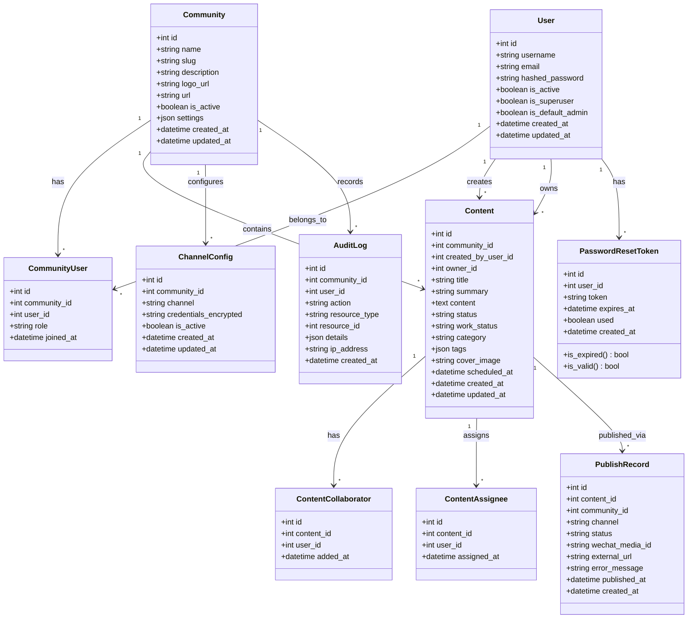

---

## 2. 领域模型类图 — 治理域

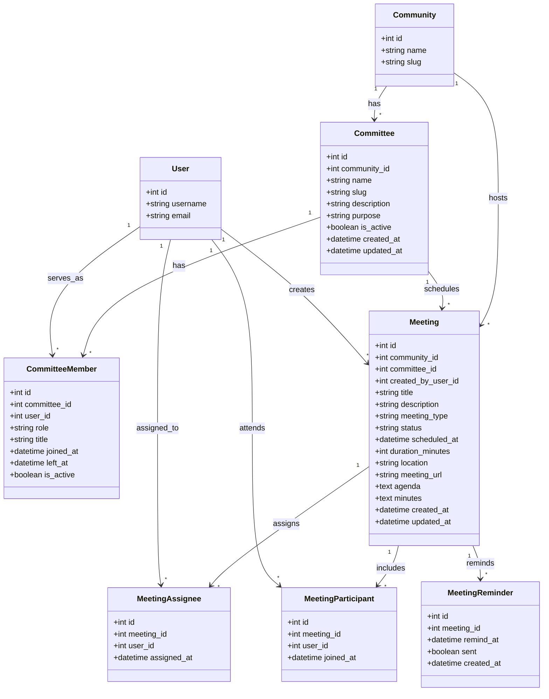

---

## 3. 核心服务类图

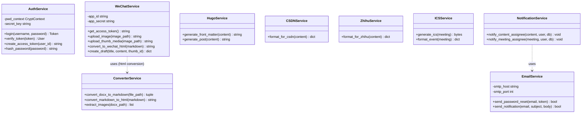

---

## 4. 用户登录时序图

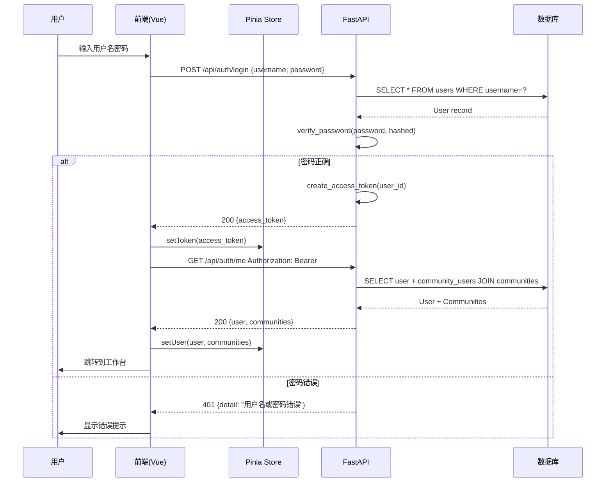

---

## 5. 密码重置时序图

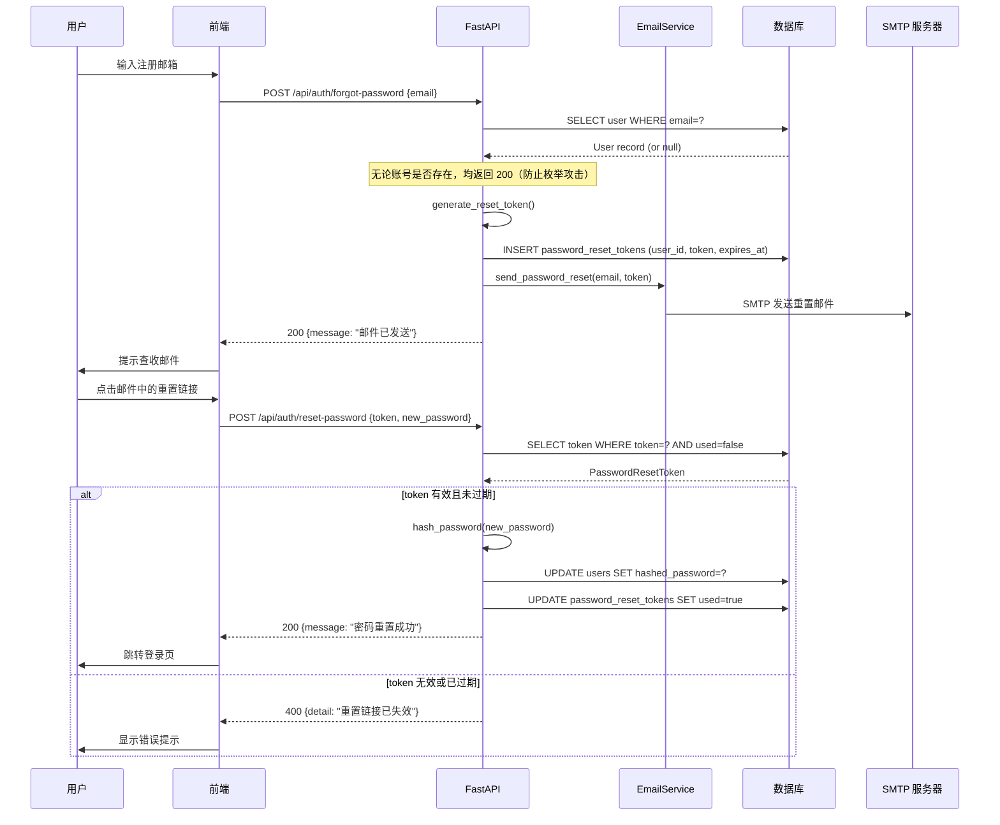

---

## 6. 社区切换时序图

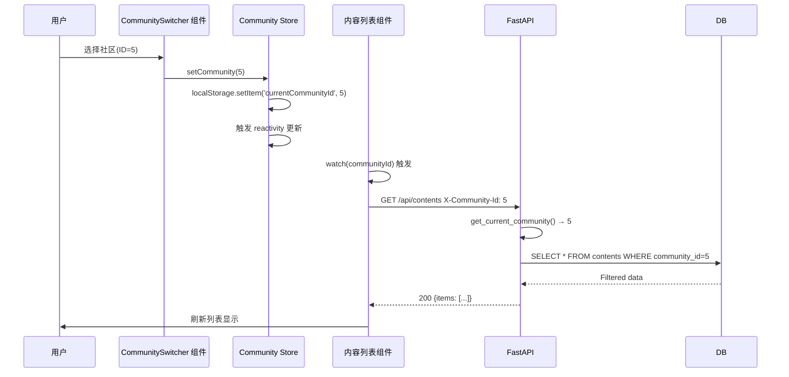

---

## 7. 内容发布到微信时序图

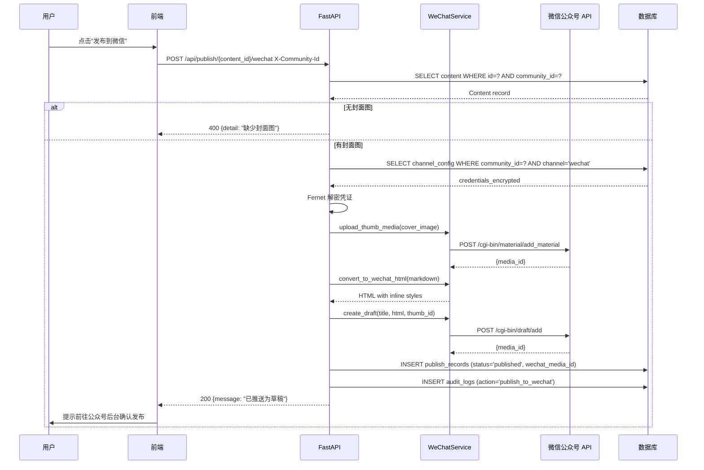

---

## 8. 日历视图拖拽排期时序图

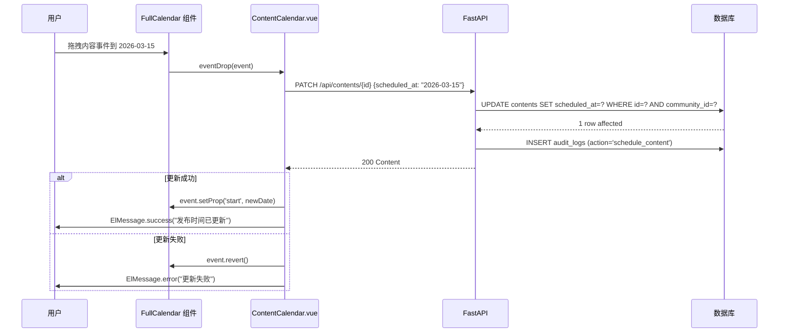

---

## 9. 内容状态流转时序图（看板拖拽）

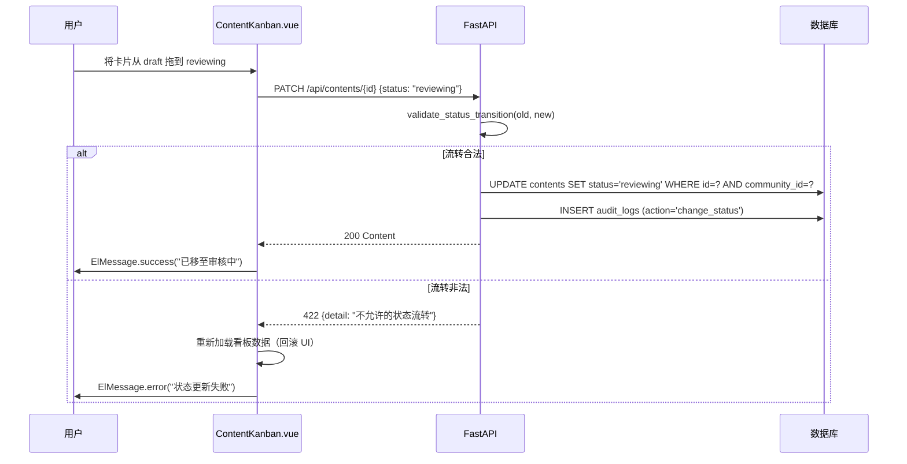

---

## 10. 会议管理与 ICS 导出时序图

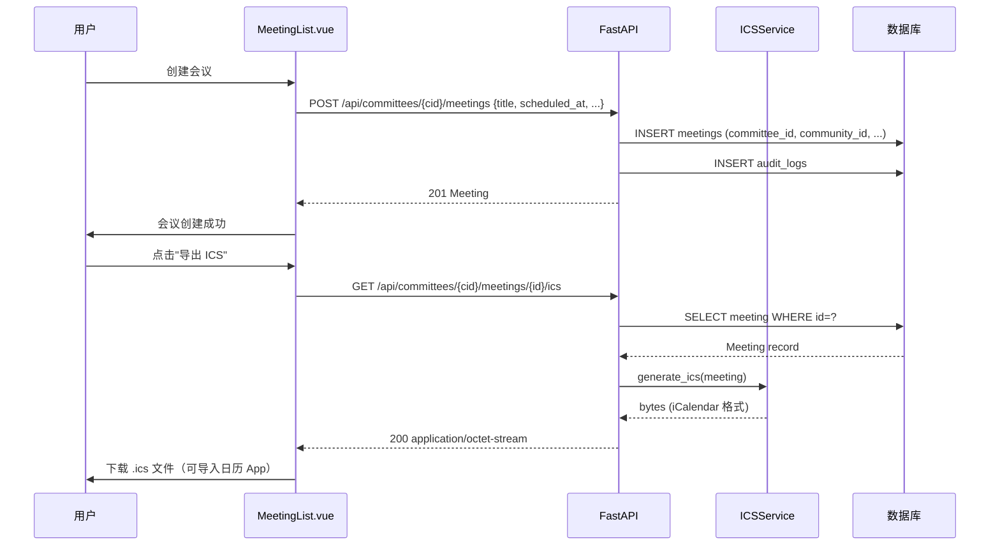

---

## 11. 状态机图 — 内容状态流转

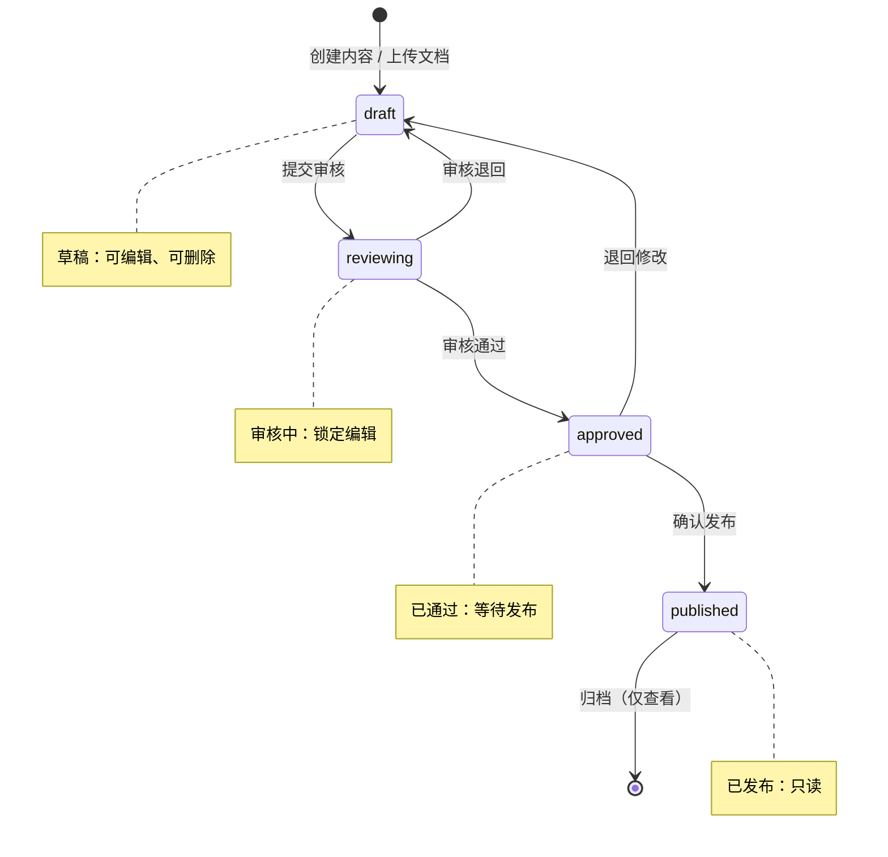

**状态转换规则**:

| 当前状态 | 允许流转到 | 禁止流转到 |
|---------|-----------|-----------|
| draft | reviewing | approved, published |
| reviewing | approved, draft | published |
| approved | published, draft | reviewing |
| published | — | draft, reviewing, approved |

---

## 12. 活动图 — DOCX 文件上传处理

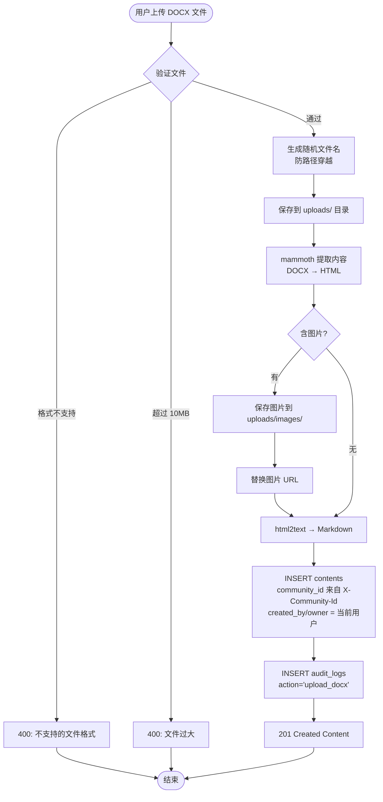

---

## 13. 部署图

```mermaid
graph TB
    subgraph "用户设备"
        Browser[Web 浏览器]
    end

    subgraph "Docker 主机"
        subgraph "Frontend 容器"
            Nginx[Nginx 静态服务]
            VueApp[Vue 3 SPA]
        end

        subgraph "Backend 容器"
            Uvicorn[Uvicorn ASGI]
            FastAPI[FastAPI Python 3.11]
        end

        subgraph "Database"
            SQLite[(SQLite\n开发)]
            Postgres[(PostgreSQL 15\n生产)]
        end

        subgraph "存储卷"
            Uploads[/uploads\n文档 + 图片]
        end
    end

    subgraph "外部服务"
        WeChatAPI[微信公众号 API]
        HugoRepo[Hugo Git 仓库]
        SMTP[SMTP 邮件服务]
    end

    Browser -->|HTTPS :443| Nginx
    Nginx -->|/api proxy :8000| Uvicorn
    FastAPI -->|SQLAlchemy ORM| Postgres
    FastAPI -->|文件读写| Uploads
    FastAPI -->|HTTPS| WeChatAPI
    FastAPI -->|Git Push| HugoRepo
    FastAPI -->|SMTP| SMTP
```

---

## 14. 包图

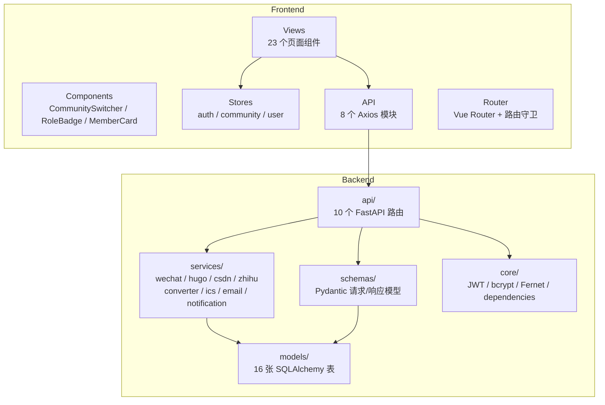

---

## 15. 前端组件图

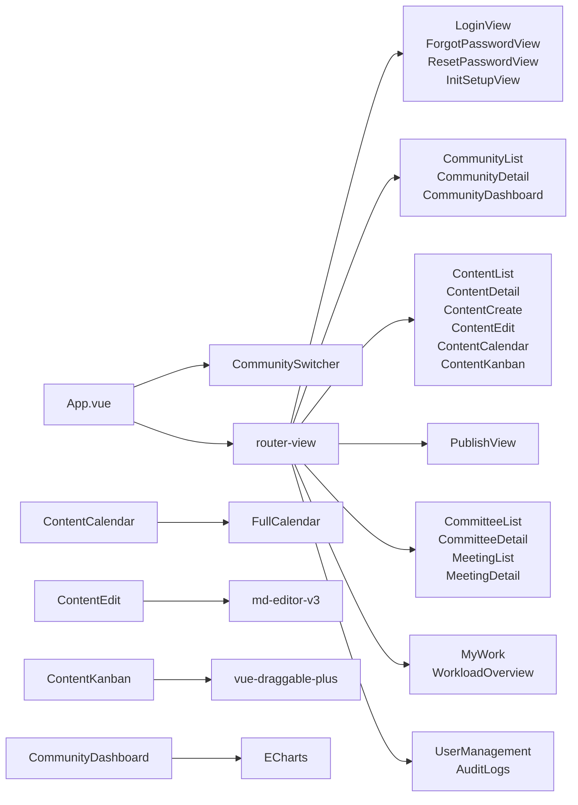

---

## 16. 用例图

```mermaid
graph TB
    subgraph "openGecko 系统"
        subgraph "认证与账号"
            UC1[登录系统]
            UC2[重置密码]
            UC3[切换社区]
        end

        subgraph "内容管理"
            UC4[创建/编辑内容]
            UC5[上传 DOCX]
            UC6[内容日历排期]
            UC7[看板状态管理]
            UC8[发布到微信/Hugo/CSDN/知乎]
        end

        subgraph "社区治理"
            UC9[管理委员会]
            UC10[管理委员会成员]
            UC11[管理会议]
            UC12[导出会议 ICS]
        end

        subgraph "工作台"
            UC13[个人工作台]
            UC14[社区总览仪表板]
            UC15[工作量总览]
        end

        subgraph "管理（Admin+）"
            UC16[社区管理]
            UC17[成员管理]
            UC18[渠道配置]
            UC19[用户管理]
            UC20[审计日志]
        end
    end

    UserRole[社区成员 user]
    AdminRole[社区管理员 admin]
    SuperRole[超级管理员 superuser]

    UserRole --> UC1 & UC2 & UC3
    UserRole --> UC4 & UC5 & UC6 & UC7 & UC8
    UserRole --> UC9 & UC10 & UC11 & UC12
    UserRole --> UC13 & UC14

    AdminRole --> UC16 & UC17 & UC18

    SuperRole --> UC19 & UC20 & UC15

    style UserRole fill:#cce5ff
    style AdminRole fill:#fff3cd
    style SuperRole fill:#ffcccc
```

---

## 17. 对象图 — 多社区运行时实例

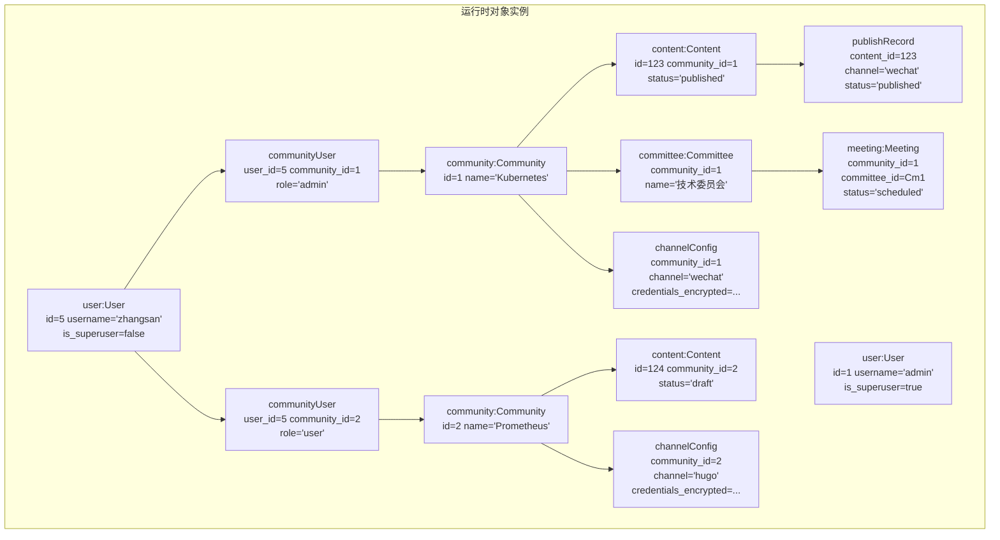

**说明**：此图展示多租户运行时实例关系：
- 用户 zhangsan 同时属于 2 个社区（不同角色）
- 每个社区有独立的内容、委员会、渠道配置
- 超级管理员 admin 拥有跨社区访问权限
- 委员会与会议归属单一社区，数据完全隔离

---

## 附录：Mermaid 渲染工具

本文档使用 Mermaid 文本格式，可在以下工具中渲染：
- GitHub / GitLab（原生支持）
- VS Code 插件：Markdown Preview Mermaid Support
- 在线工具：https://mermaid.live/
- Obsidian、Typora 等 Markdown 编辑器
